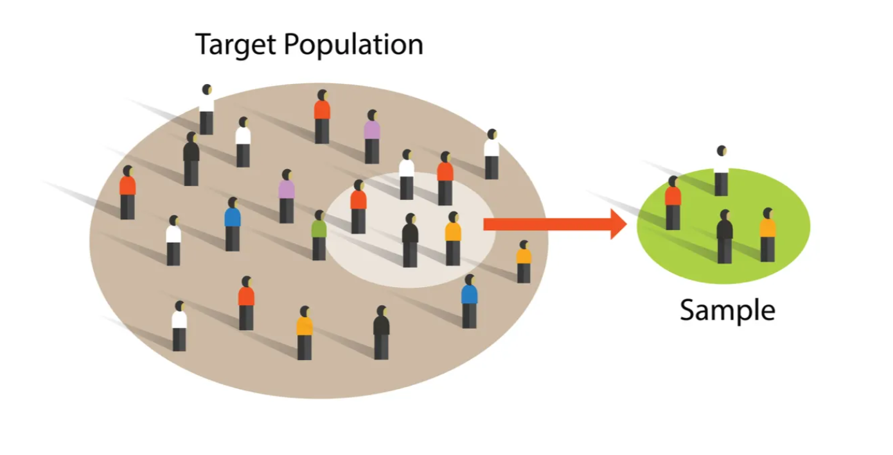
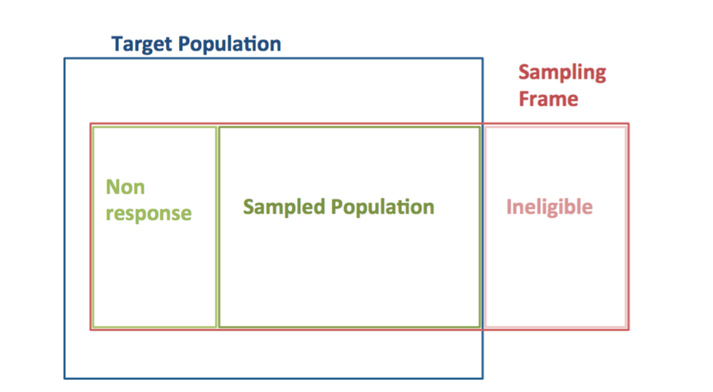
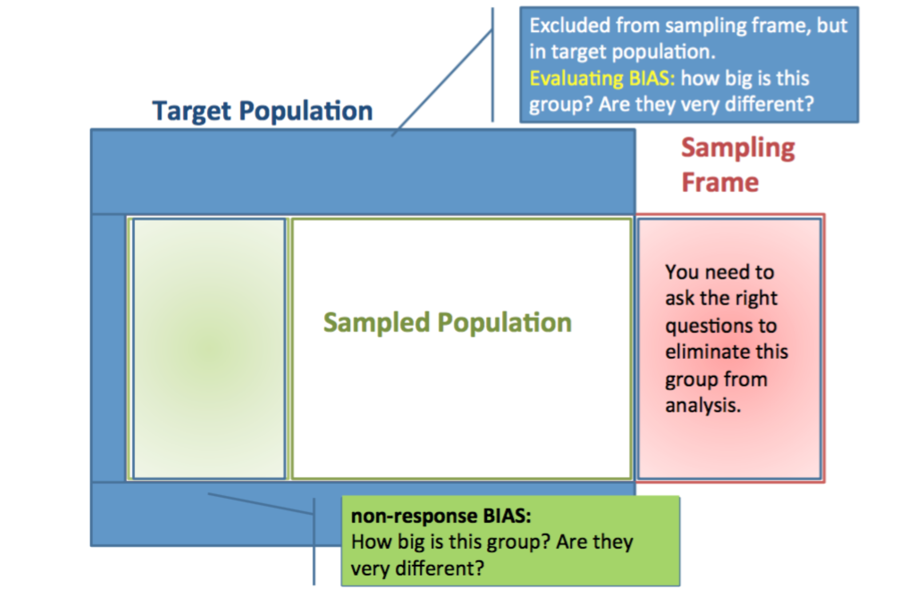
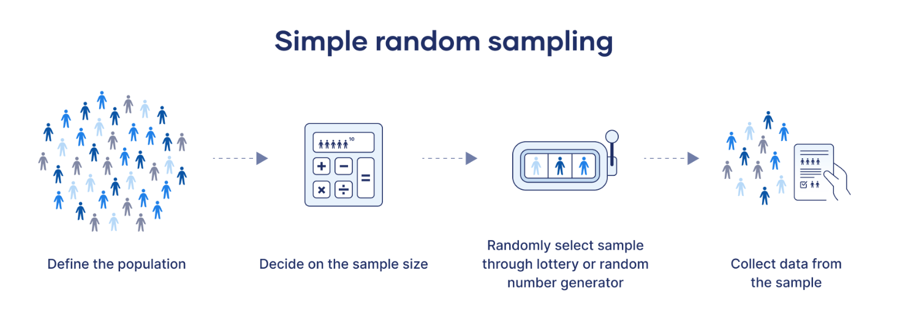
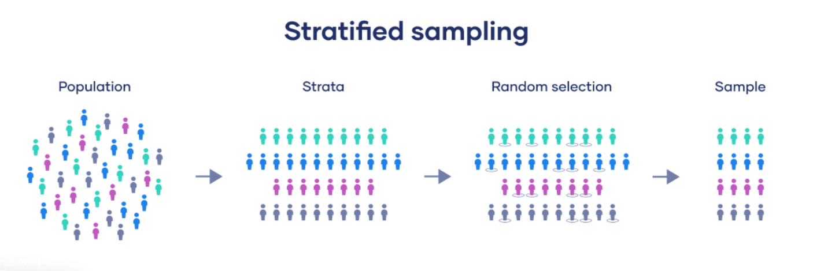
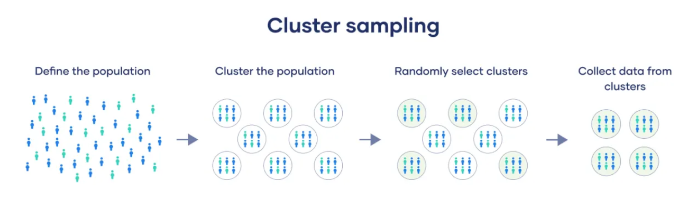
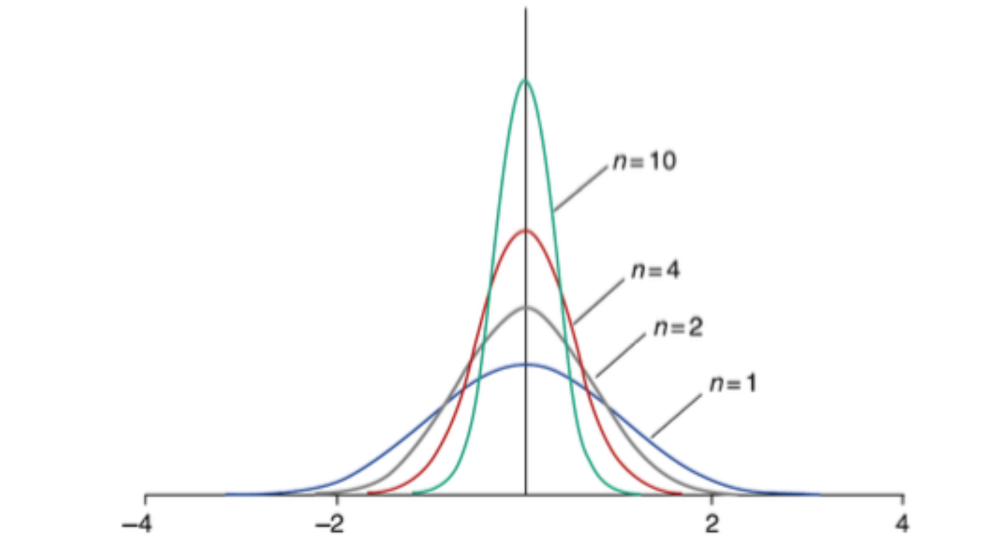

```{r}
#| echo: false
#| results: false

library(tidyverse)
library(here)
library(patchwork)

attain <- read_csv(here("data/attain.csv"))
```

## Housekeeping {.smaller}

**HW 4:** 

- Great job overall: minor issues across the class.

**Open Week Topic:**

- Will send out a survey for topics for open week after class today. Please answer by **March 17**.

## Where We Are in the Course {.smaller}

- **Weeks 5–6:** rules of probability + probability models (Bernoulli, Binomial, Normal)
- **This week (Week 7):** sampling distributions and the Central Limit Theorem
- **Next week (Week 8):** confidence intervals
- **Then (Week 9):** hypothesis testing

**Main idea:** We've been building probability models of *populations*. Today we ask: what happens when we draw a *sample*—and then another, and another? The answer is what makes all of statistical inference possible.

::: {.callout-note icon=false}
## The answer: 
When we draw a sample—and then another, and another—the sample statistics vary in a systematic, mathematically predictable way. That predictable variation is what makes statistical inference possible.
:::

## Agenda {.smaller}

**Admin discussion:**

- Research paper proposals and annotated bibliography

**Statistical content — three parts:**

- **Part 1**: Sampling — from populations to data
- **Part 2**: Sampling distributions — statistics vary from sample to sample
- **Part 3**: The Central Limit Theorem — the key that unlocks inference

**In-class lab:**

- work through some basic data management for your research project

## Research Paper Proposals {.smaller}

Only about halfway done will finish by next week. 

**Overall, great job—super interesting topics so far!**

I will give feedback in two areas:

1. **Research design**: How to construct variables of interest, what units of analysis may be most appropriate, other issues you may want to think about going forward

2. **What has been written in the academic literature** on your topic — some topics have been studied a lot, which is a **good sign** that your question is important!

**If your question seems already answered**: try a different data source, or look for related unanswered questions in paper conclusions. Happy to discuss in office hours!

## Annotated Bibliography {.smaller}

<span class="highlight">Due March 19</span>

Identify **ten scholarly sources** related to your research question

For each source: in **two short paragraphs**: 

1. summarize what the source is arguing
2. explain how it relates to your research question

::: {.panel-tabset}

### Good sources:

- Articles in academic journals
- Academic books
- Book chapters from edited volumes
- Non-political reports from research centers / government agencies

### Bad sources:

- Blogs, internet / newspaper articles
- Wikipedia pages
- Political reports from research centers / govt

:::

## How to Find Academic Articles {.smaller}

**Search on Google Scholar or JSTOR**

You'll usually get somewhere by taking your independent and dependent variables and searching for:

> "effect of *independent variable* on *dependent variable*"

You may need to use a [UC Berkeley Library proxy](https://search.library.berkeley.edu/discovery/search?vid=01UCS_BER:UCB) to access some academic articles

This is a [helpful webpage](https://guides.lib.berkeley.edu/ezproxy/home) for using the proxy server and here is a [link to make a virtual appointment](https://ucberkeley.libanswers.com/faq/302000) for research help

<span class="highlight">NOTE: AI will hallucinate citations, so don't use</span>

## How to Read Academic Articles {.smaller}

| Section | What to look for |
|-|---|
| **Abstract** | Overview: research question, data, main result — read first |
| **Introduction** | Slightly more detailed than abstract; same format |
| **Conclusion** | Results, alternative explanations, limitations — and **future research topics** |
| **Background / Lit review** | Previous research; a **good source of additional citations** |
| **Data section** | How the sample was constructed; what data sources researchers use |
| **Methods** | Don't worry about this too much yet! |

:::{.aside}
**Tip**: Start with abstract → conclusion → introduction. Only go deeper if the paper is clearly relevant.
:::

## Questions?

# Part 1: From Populations to Samples

How do we go from an abstract population to real data we can analyze?

## Sampling: Basic Concepts {.smaller}

| | **Population** | **Sample** |
|-|---|---|
| **Concept** | The whole universe a study aspires to generalize to | The subset of the population we actually observe |
| **Quantity** | **Parameter** — a number describing the population (usually unknown) | **Statistic** — a number computed from the data |
| **Example** | True proportion of Philadelphia residents who are African American: $\pi = 0.422$ | Proportion of stopped drivers who were African American: $\hat{p} = 0.79$ |

<br>
<span class="highlight">**The goal of statistical inference**</span>: use a sample *statistic* to learn about a population *parameter* — we've been building toward this all semester

## Sampling from a Population {.smaller}

Start with a **population** — every individual you want to study. In our running example, this is all 1.45 million residents of Philadelphia in 1997. Since you can't talk to everyone, you have to take a representive **sample**, that will approximate your population.  

{width="75%" fig-align="center"}

## Sampling from a Population {.smaller}

A **sample** is drawn from the population — the individuals we actually observe. The 262 drivers stopped by police are our sample, far smaller than the full population.

{width="75%" fig-align="center"}

## Sampling from a Population {.smaller}

**Key question**: is our sample *representative*? Does it reflect the composition of the population? This depends entirely on the sampling design — random samples are representative; convenience samples often are not.

{width="75%" fig-align="center"}

## Sample Design {.smaller}

To do inferential statistics, we need a **representative sample** — ideally, each unit of the population has an equal chance of being included

We also want samples that are **large enough for precision**, which increases with sample size

<br> 

::: {.callout-tip icon=false}
## Important note
Precision is inversely proportional to the diversity of values — larger samples are needed to draw inferences about small subgroups (by race, education, sexual orientation, etc.)
:::


## Types of Sampling Designs {.smaller}

::: {.panel-tabset}

### Simple random

**Simple random sample:** Use a random number generator to select from a population list

{width="80%" fig-align="center"}

### Stratified random

**Stratified random sample**: Divide population into homogenous groups (strata), then randomly sample within each stratum

- Generally improves precision
- Can over-sample smaller strata (e.g., minority groups) to make inferences *within* those groups

{width="65%" fig-align="center"}

### Cluster

**Cluster sampling**:

1. Create subpopulations (clusters)
2. Randomly select a sample of clusters
3. Randomly select units within sampled clusters

{width="65%" fig-align="center"}

:::

## Stratified vs. Cluster Sampling {.smaller}

:::{.columns}

:::{.column width="55%"}

**Key difference**: cluster sampling selects only *some* groups; stratified sampling samples from *all* strata.

<br> 

**When to use which:**

- **Cluster**: use when sampling individuals directly is costly (e.g., 4th graders in California)
- **Stratified**: use when you need better representation of known subgroups (e.g., GPA by major)

:::

:::{.column width="45%"}

{width="100%" fig-align="center"}

{width="100%" fig-align="center"}

:::

:::

## Representative Samples & Sample Weights {.smaller}

::: {.panel-tabset}

### The Problem

True random samples are almost never feasible — we rarely have a complete population list

**But** we often know the *probability* that each individual would be selected, based on demographics, geography, or other characteristics

### Sample Weights

**Weights** are set inversely proportional to the probability of selection:

- Individuals *less likely* to be sampled → *higher* weight
- Individuals *more likely* to be sampled → *lower* weight
- Result: a weighted sample that mirrors the full population

### GSS Example

The GSS uses cluster sampling. Within each selected household, only one adult is chosen:

- Individuals in *larger* households are *less* likely to be selected → *higher* weights
- Additional weights for oversampled Black respondents
- Additional weights for non-responders on the first contact

<span class="highlight">Always check whether your dataset uses weights, and apply them in R</span>

:::

# Part 2: Sampling Distributions

Statistics vary from sample to sample — they have their own distributions

## What is a Sampling Distribution? {.smaller .scrollable}

A **sampling distribution** is the probability distribution of a sample statistic computed across many independent samples from the same population

**Three distributions you must keep straight:**

| Distribution | What it describes | Philadelphia example |
|---|---|---|
| **Population** | All individuals in the population | 1.45M Philadelphia residents, 42.2% African American |
| **Sample (data)** | The individuals in *our* sample | 262 police stops in 1997 |
| **Sampling** | How our statistic would vary across *repeated* samples | Distribution of $\hat{p}$ across many random samples of 262 |

::: {.callout-note icon=false}

## Key insights
- Sampling distributions describe **variability from study to study**
- They tell us **how close a statistic is likely to fall** to the true population parameter
- They are **not what we observe** — they represent what we *would* observe across many hypothetical repetitions
- They are the foundation for confidence intervals (Week 8) and hypothesis tests (Week 9)
:::

## Sampling Distribution of a Proportion {.smaller}

::: {.panel-tabset}

### The bridge from Week 6

Recall: $X \sim B(n, \pi)$ has mean $n\pi$ and SD $\sqrt{n\pi(1-\pi)}$

The **sample proportion** $\hat{p} = X/n$ divides that count by $n$. It's sampling distribution:

$$\mu_{\hat{p}} = \frac{n\pi}{n} = \pi \qquad SE(\hat{p}) = \frac{\sqrt{n\pi(1-\pi)}}{n} = \sqrt{\frac{\pi(1-\pi)}{n}}$$

**Same formula as last week's Binomial SD — divided by $n$.**

### What it tells us

$$\mu_{\hat{p}} = \pi \qquad \text{(unbiased — centered on the true proportion)}$$

$$SE(\hat{p}) = \sqrt{\frac{\pi(1-\pi)}{n}} \qquad \text{(shrinks as } n \text{ grows)}$$

We use *standard error* (SE) rather than *standard deviation* to signal that this is the spread of a **sampling distribution**, not of raw data.

### Connection to inference

The SE answers: on average, how far will our $\hat{p}$ fall from the true $\pi$?

- Small $n$ → large SE → estimates can be far from the truth
- Large $n$ → small SE → estimates are reliably close to the truth

::: {.callout-note icon=false}
## key insight: 
This is the mechanism that makes large surveys more trustworthy — and why the GSS (≈3,000 respondents) gives more reliable estimates than a sample of 20.
::: 

:::

## Racial Profiling: A Worked Example {.smaller .scrollable}

::: {.panel-tabset}

### The Setup

**Data from Philadelphia, 1997:**

- **262** police car stops were recorded
- **207** of the stopped drivers were African American ($\hat{p} = 207/262 = 0.79$)
- Philadelphia's population at the time was **42.2% African American** ($\pi = 0.422$)

**Question**: If drivers were stopped at random, how likely is it that 79% of stopped drivers would be African American?

### The Math

Assume random stopping: $X \sim B(262, 0.422)$

The **sampling distribution** of $\hat{p}$ under random stopping:

$$\mu_{\hat{p}} = 0.422$$

$$SE(\hat{p}) = \sqrt{\frac{0.422 \times 0.578}{262}} \approx 0.030$$

### The Verdict 

**Observed**: $\hat{p} = 0.79$

**Distance from expected**:

$$z = \frac{0.79 - 0.422}{0.030} \approx 12 \text{ standard errors above the mean}$$

Under random stopping, $\hat{p} = 0.79$ is essentially impossible — it lies 12 SEs above what we'd expect. The sampling distribution reveals that this pattern cannot be explained by chance, but some other bias.

```{r}
#| echo: false
#| warning: false
#| message: false
#| fig-height: 3.2
#| fig-align: center

mu  <- 0.422
se  <- sqrt(0.422 * 0.578 / 262)
obs <- 0.79

x_range  <- seq(0.27, 0.95, length.out = 3000)
df_curve <- tibble(x = x_range, y = dnorm(x_range, mean = mu, sd = se))
peak     <- dnorm(mu, mu, se)

ggplot(df_curve, aes(x, y)) +
  geom_area(fill = "#4E79A7", alpha = 0.25) +
  geom_line(color = "#4E79A7", linewidth = 1) +
  geom_vline(xintercept = mu, linetype = "dashed", color = "gray50", linewidth = 0.6) +
  annotate("text", x = mu + 0.004, y = peak * 0.9,
           label = "π = 0.422", hjust = 0, size = 3, color = "gray30") +
  geom_point(data = tibble(x = obs, y = 0), aes(x, y),
             color = "#E15759", size = 4) +
  annotate("text", x = obs, y = peak * 0.12,
           label = "p̂ = 0.79\n(z ≈ 12)", color = "#E15759", hjust = 0.5, size = 3) +
  labs(x = expression(hat(p)), y = "Density",
       title = "Sampling distribution of p̂ under random stopping") +
  scale_x_continuous(breaks = c(0.30, 0.422, 0.55, 0.70, 0.79)) +
  theme_minimal(base_size = 10) +
  theme(plot.title = element_text(hjust = 0.5, size = 10))
```

:::

## Visualizing the Sampling Distribution {.smaller}

As $N$ increases, $\hat{p}$ becomes **tighter and more bell-shaped** — the Central Limit Theorem in action:

```{r}
#| echo: false
#| warning: false
#| message: false
#| fig-height: 5
#| fig-align: center

set.seed(106)
n_sims       <- 5000
pi_val       <- 0.422
sample_sizes <- c(4, 8, 40, 400, 4000, 40000)

fmt_n <- function(n) formatC(n, format = "d", big.mark = ",")

# Pre-generate samples for all N in sequence (single seed)
all_draws <- map(sample_sizes, ~ rbinom(n_sims, size = .x, prob = pi_val) / .x)

make_panel <- function(n, draws) {
  df <- tibble(p_hat = draws)
  se <- sqrt(pi_val * (1 - pi_val) / n)

  hist_layer <- if (n <= 400) {
    geom_histogram(aes(y = after_stat(density)), binwidth = 1 / n,
                   boundary = 0, fill = "#4E79A7", color = "white",
                   linewidth = 0.15)
  } else {
    geom_histogram(aes(y = after_stat(density)), bins = 60,
                   fill = "#4E79A7", color = "white", linewidth = 0.15)
  }
  ggplot(df, aes(x = p_hat)) +
    hist_layer +
    stat_function(fun = dnorm, args = list(mean = pi_val, sd = se),
                  color = "#E15759", linewidth = 0.9) +
    labs(x = NULL, y = NULL,
         title = paste0("N = ", fmt_n(n))) +
    theme_minimal(base_size = 10) +
    theme(plot.title = element_text(face = "bold", hjust = 0.5),
          axis.text  = element_text(size = 7))
}

panels <- map2(sample_sizes, all_draws, make_panel)

wrap_plots(panels, nrow = 2) +
  plot_annotation(
    title   = "Sampling distribution of p̂ as N grows  (π = 0.422)",
    #caption = "Red dashed line = true π  |  5,000 simulated samples per panel",
    theme   = theme(
      plot.title   = element_text(size = 12),
      plot.caption = element_text(color = "gray50", size = 8)
    )
  )
```

## Sampling Distribution of the Mean {.smaller}

::: {.panel-tabset}

### The Formula

For a random sample of size $n$ from a population with mean $\mu$ and standard deviation $\sigma$:

$$\mu_{\bar{x}} = \mu \qquad \text{(sample mean is unbiased)}$$

$$SE(\bar{x}) = \frac{\sigma}{\sqrt{n}} \qquad \text{(precision increases with sample size)}$$

Doubling $n$ cuts the SE by a factor of $\sqrt{2}$ — not 2. Precision is expensive!

### Worked Example

**The problem**: You manage a pizza restaurant and want to estimate your true average daily sales. You know from years of records that daily sales average $\mu = \$900$ with a standard deviation of $\sigma = \$300$ — but sales fluctuate day to day. If you observe only $n = 7$ days, how close will your sample mean be to the true average?

$$SE(\bar{x}) = \frac{\$300}{\sqrt{7}} \approx \$113$$

A 7-day average will typically be within $\pm\$226$ (2 SEs) of the true mean — so your estimate could easily be off by over $200. Observing 28 days instead cuts the SE in half: $\frac{\$300}{\sqrt{28}} \approx \$57$, giving a much more reliable estimate.

### The Visual

As $n$ grows, the sampling distribution narrows around the true mean $\mu$:

{width="65%" fig-align="center"}

:::

# Part 3: The Central Limit Theorem

The theorem that makes all of statistical inference possible

## The Central Limit Theorem {.smaller}

**This is one of the most powerful theorems in all of statistics.**

> If repeated independent samples of size $N$ are drawn from **any population** (regardless of its shape) having mean $\mu$ and standard deviation $\sigma$, then — as $N$ becomes large — the sampling distribution of the sample mean approaches a Normal distribution:
>
> $$\bar{x} \;\sim\; N\!\left(\mu,\; \frac{\sigma}{\sqrt{N}}\right)$$

**Why is this remarkable?** The *population* can be skewed, bimodal, uniform — it doesn't matter. As long as $N$ is large enough, $\bar{x}$ is approximately Normal.

This is why the Normal distribution appears everywhere in statistics — and why the tools we build next all work.

## CLT: Interactive Demo {data-background-iframe="https://seeing-theory.brown.edu/probability-distributions/index.html#section3" data-background-interactive="true"}

## How Large a Sample? {.smaller}

The sampling distribution approaches normality faster for more symmetric populations:

- If the **population distribution is Normal**, the sampling distribution is Normal for *any* $n$
- The more **skewed** the population, the larger $n$ must be
- **In practice**: $n > 30$ is usually sufficient for most real-world distributions

::: {.fragment .fade-up}
**Why this matters for your research**: Most survey samples (GSS, IPUMS, etc.) have $n$ in the hundreds or thousands — well above the threshold where CLT guarantees apply. This is what lets us do inference from survey data without knowing the full population distribution.
:::

## Weekly Work Hours: A Worked Example {.smaller .scrollable}

::: {.panel-tabset}

### Setup

**GSS data** show that among employed US adults, weekly work hours are right-skewed: $\mu = 40.5$ hours, $\sigma = 14$ hours.

A labor researcher samples $n = 35$ workers at a specific company and finds a mean of 45 hours/week.

**Question**: If this company is typical of the US workforce, how unusual is a sample mean of 45 hours or higher?

### Applying the CLT

The population is **right-skewed** — but $n = 35 > 30$, so the CLT applies:

$$SE(\bar{x}) = \frac{\sigma}{\sqrt{n}} = \frac{14}{\sqrt{35}} \approx 2.37$$

$$\bar{x} \sim N(40.5,\; 2.37)$$

Even though individual work hours are skewed, the *sample mean* is approximately Normal.

### Solution

**Compute the probability in R**

```{r}
#| echo: true
#| eval: true

pnorm(45, mean = 40.5, sd = 14 / sqrt(35), lower.tail = FALSE)
```

About **2.9%** — if the company were typical, a mean this high would occur only 3% of the time by chance. This gives the researcher grounds to argue the company is unusually demanding.

::: {.callout-note icon=false}
## Why `sd = 14/sqrt(35)` and not `sd = 14`?

The `sd` argument must match the distribution you're asking about. Here the question is about a **sample mean**, not an individual worker:

```r
pnorm(45, mean = 40.5, sd = 14)             # P(one worker > 45 hrs) ≈ 37%
pnorm(45, mean = 40.5, sd = 14/sqrt(35))    # P(sample mean > 45 hrs) ≈ 3%
```

The same gap feels very different depending on scale. A single worker putting in 45 hours is common — but a *group average* of 45 hours is rare, because averaging 35 people smooths out the extremes. That shrinkage by $\sqrt{n}$ is exactly what the SE captures.
:::

### The CLT in Action

```{r}
#| echo: false
#| warning: false
#| message: false
#| fig-height: 3.5
#| fig-align: center

set.seed(106)
mu_pop <- 40.5
sd_pop <- 14
n      <- 35
n_sims <- 5000

# Simulate a right-skewed population (gamma) with the right mean and SD
shape <- mu_pop^2 / sd_pop^2
scale <- sd_pop^2 / mu_pop
pop   <- pmin(rgamma(200000, shape = shape, scale = scale), 80)

sample_means <- replicate(n_sims, mean(sample(pop, n, replace = TRUE)))
se           <- sd_pop / sqrt(n)

p1 <- ggplot(tibble(x = pop), aes(x)) +
  geom_histogram(aes(y = after_stat(density)), bins = 45,
                 fill = "#4E79A7", color = "white", linewidth = 0.2) +
  labs(title = "Population distribution\n(right-skewed)",
       x = "Hours per week", y = "Density") +
  theme_minimal(base_size = 10) +
  theme(plot.title = element_text(hjust = 0.5, size = 9, face = "bold"))

p2 <- ggplot(tibble(x = sample_means), aes(x)) +
  geom_histogram(aes(y = after_stat(density)), bins = 45,
                 fill = "#59A14F", color = "white", linewidth = 0.2) +
  stat_function(fun = dnorm, args = list(mean = mu_pop, sd = se),
                color = "#E15759", linewidth = 1) +
  geom_vline(xintercept = 45, linetype = "dashed", color = "#E15759", linewidth = 0.7) +
  annotate("text", x = 45.3, y = dnorm(mu_pop, mu_pop, se) * 0.6,
           label = "x̄ = 45", color = "#E15759", hjust = 0, size = 3) +
  labs(title = "Sampling distribution of x̄\n(n = 35 → approximately Normal)",
       x = "Sample mean hours", y = "Density") +
  theme_minimal(base_size = 10) +
  theme(plot.title = element_text(hjust = 0.5, size = 9, face = "bold"))

p1 + p2 +
  plot_annotation(title = "CLT: skewed population, Normal sampling distribution",
                  theme = theme(plot.title = element_text(size = 10, hjust = 0.5)))
```

:::


## Key Takeaways {.smaller}

- **Populations** have parameters; **samples** have statistics — and they're different things
- A **sampling distribution** describes how a statistic varies across many hypothetical samples
- The **standard error** (SE) measures this variability — it shrinks as $\sqrt{n}$ grows
- The **Central Limit Theorem** guarantees that sample means are approximately Normal for large $n$, regardless of the population shape

::: {.callout-note icon=false}
## key takeaway: 
Sample → statistic → sampling distribution → inference. This is the chain that runs through the rest of the course.
:::

## Why This Matters for the Rest of the Course {.smaller}

- **Next week (Week 8):** Confidence intervals use the SE and the Normal approximation to build a range of plausible parameter values
- **Week 9:** Hypothesis tests ask "how far is our statistic from what we'd expect?" — measured in standard errors
- **Weeks 11–13 (Regression):** Every regression coefficient comes with a standard error and a significance test — all built on exactly the CLT logic we developed today

::: {.callout-note icon=false}
## key takeaway: 
The CLT is not just this week's topic. It is the engine of all classical statistical inference. Once you understand it, you understand *why* every test we'll do actually works.
::: 

## Questions?

## Assignments {.smaller}

**Weekly Assignment #6**

- <span class="highlight">Due Thursday, March 12</span> by 11:59 PM
- Format: mix of word problems and R (similar to previous weeks)

**Annotated Bibliography**

- <span class="highlight">Due Thursday, March 19</span>
- Finding 10 relevant papers takes time — start early!
- Don't expect the first papers you find to be relevant to your project
- Happy to help during office hours

## In-class Lab #4 {.smaller}

1. Download `lab4.qmd` from bCourses under "assignments" > "Lab #4"
2. Place `lab4.qmd` in your `labs` folder
3. Use the `Explorer` button on the left to find and open `lab4.qmd`
4. Let's work through it together!
