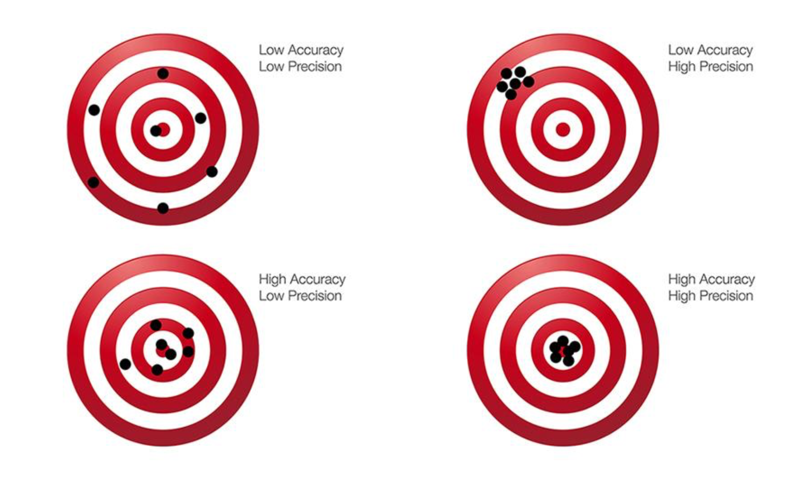
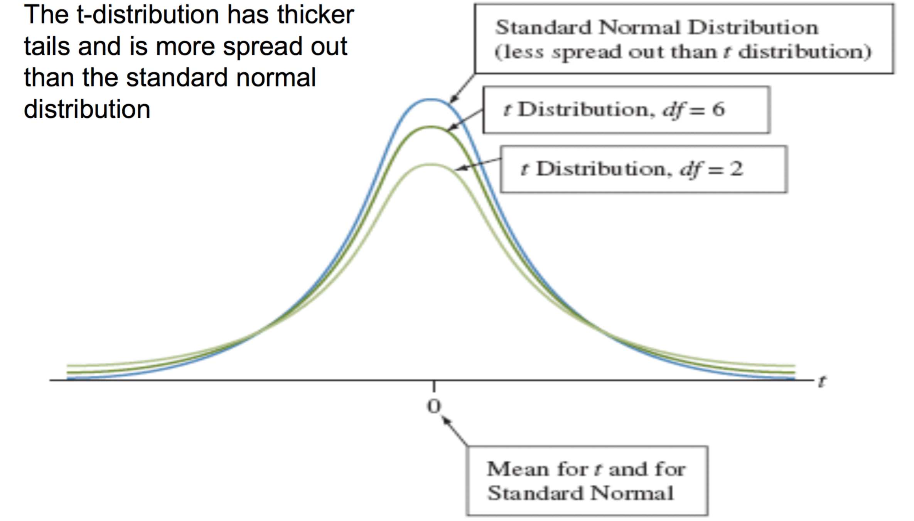

```{r}
#| echo: false
#| results: false

library(tidyverse)
library(here)
library(patchwork)

attain <- read_csv(here("data/attain.csv"))
```

## Agenda {.smaller}

**In-class lab:**

- Finish up where we left on last week

**Housekeeping:**

- Annotated bibliography
- Homework #6
- Finding academic articles

**Statistical content — three parts:**

- **Part 1**: From sampling to estimation — point estimates, bias, efficiency
- **Part 2**: Confidence intervals for proportions (z-distribution)
- **Part 3**: Confidence intervals for means (t-distribution)


## Housekeeping {.smaller}

**Annotated Bibliography**: <span class="highlight">Due Thursday, March 19</span>

- Example posted on bCourses under the Research Paper folder
- Format: **two short paragraphs** per source:
  1. Summarize what the source is arguing
  2. Explain how it relates to your research question

**Weekly Assignment #7**

- <span class="highlight">Due Thursday, March 19</span>
- Will involve applying confidence intervals from today's lecture

**Week 14 lecture:**

- Focus on mediation analysis. 

## Homework #6 and Paper Proposal {.smaller .scrollable}

**Homework #6:**

- Great job! 
- Remember to subtract 1 from the lower value when trying to calculate probabilities between. 
  - Since `pbinom(x) = P(X ≤ x)` and includes `x`, you subtract 1 from the lower bound: `pbinom(6) - pbinom(3)` gives `P(4 ≤ X ≤ 6)` because pbinom(3) already includes 3, removing it from the range.

**Paper proposal:**

- **Walk through specific scenarios to identify mechanisms:** imagine a specific individual and think through their experiences
- **Research design**: How can you construct variables of interest? 
- **What has already been written in the literature:** some topics have been studied a lot, which is a good! What can you add, what new angle can you take?
- **Mediation vs moderation**: 
    - **Mediation:** X causes X, which then causes Y (X > Z > Y)
    - **Moderation:** The effect of X on Y is bigger/smaller/different depending on Z

## Annotated Bibliography {.smaller}

<span class="highlight">Due March 19</span>

Identify **ten scholarly sources** related to your research question

For each source: in **two short paragraphs**:

1. summarize what the source is arguing
2. explain how it relates to your research question

::: {.panel-tabset}

### Good sources

- Articles in academic journals
- Academic books
- Book chapters from edited volumes
- Non-political reports from research centers / government agencies

### Bad sources

- Blogs, internet / newspaper articles
- Wikipedia pages
- Political reports from research centers / govt

:::

Here is a [link to an example](https://www.kaseyzapatka.com/soc106/assignments/paper/02_bibliography.html) of one source: you will need 10.

## Strategies to Find Academic Articles {.smaller}

1. **Search on Google Scholar or JSTOR:** take your independent and dependent variables and searching for:

> "effect of *independent variable* on *dependent variable*"

May need to use a [UC Berkeley Library proxy](https://search.library.berkeley.edu/discovery/search?vid=01UCS_BER:UCB) to access some academic articles. This is a [helpful webpage](https://guides.lib.berkeley.edu/ezproxy/home) for using the proxy server and here is a [link to make a virtual appointment](https://ucberkeley.libanswers.com/faq/302000) for research help.

2. Find one good citation on google scholar and **see who cites them**: see the `cited by` icon under the citation
3. Find a relevant article, **mine useful citations** from the literature review

::: {.callout-tip icon=false}
## Don't use AI for this:
AI will hallucinate citations more often than not, so don't use it for this. Google Scholar is probably your best bet here!
:::

## How to Read Academic Articles {.smaller}

| Section | What to look for |
|-|---|
| **Abstract** | Overview: research question, data, main result — read first |
| **Introduction** | Slightly more detailed than abstract; same format |
| **Conclusion** | Results, alternative explanations, limitations — and **future research topics** |
| **Background / Lit review** | Previous research; a **good source of additional citations** |
| **Data section** | How the sample was constructed; what data sources researchers use |
| **Methods** | Don't worry about this too much yet! |

::: {.callout-tip icon=false}
## Order of operations:
Start with abstract → conclusion → introduction. Only go deeper if the paper is clearly relevant.
:::

## Questions?

# Part 1: From Sampling to Estimation

Using what we know about sampling distributions to make inferences

## Where We Are in the Course {.smaller}

- **Weeks 5–6:** rules of probability + probability models (Bernoulli, Binomial, Normal)
- **Week 7:** sampling distributions and the Central Limit Theorem
- **This week (Week 8):** confidence intervals — using sample data to estimate population parameters
- **Next week (Week 9):** hypothesis testing

**Main idea:** Last week, we knew population parameters and built sampling distributions. Today we flip the problem: we use a *single sample* to make inferences about population parameters we cannot directly observe.

::: {.callout-note icon=false}
## The chain of inference:
**Week 7:** Population → Sample → Statistic → Sampling distribution

**Week 8:** Sample → Statistic → Sampling distribution → Confidence interval → Inference
:::

## Last Week: Recap {.smaller}

**What we learned:**

| Concept | Key idea | Philadelphia example |
|---|---|---|
| **Sampling** | A (approximately) random subset of a population | 262 police stops recorded |
| **Sampling distributions** | How a statistic varies across repeated samples | Distribution of $\hat{p}$ if stops were random |
| **CLT** | For large $n$, sample means are approximately Normal | Even skewed distributions → Normal sample mean |

::: {.callout-note icon=false}
## The key from last week:
We could construct sampling distributions because we **knew** the population parameters ($\pi = 0.422$, $\mu$, $\sigma$). Today we drop that assumption — in the real world, we almost never know these.
:::

## Flipping the Problem {.smaller}

**Last week**: Known population parameters → Build a sampling distribution

$$\text{If } \pi = 0.422 \text{ and } n = 262, \text{ then } \hat{p} \sim N\!\left(0.422,\, 0.030\right)$$

::: {.fragment .fade-up}
**This week**: Observed sample data → Estimate unknown population parameters

$$\text{We observe } \hat{p} = 0.449 \text{ from } n = 1154 \;\longrightarrow\; \text{what can we say about } \pi?$$
:::

::: {.fragment .fade-up}
::: {.callout-note icon=false}
## The fundamental shift:
We stop pretending we know the population. Instead, we use a sample statistic to construct a **range of plausible values** for the parameter — a **confidence interval**.
:::
:::

## Key Concepts {.smaller}

| | **Population** | **Sample** |
|-|---|---|
| **Concept** | The whole universe a study aspires to generalize to | The subset of the population we actually observe |
| **Quantity** | **Parameter** — a number describing the population (usually unknown) | **Statistic** — a number computed from the data |
| **Notation** | $\mu$ (mean), $\pi$ (proportion), $\sigma$ (std dev) | $\bar{x}$ (mean), $\hat{p}$ (proportion), $s$ (std dev) |
| **Example** | True proportion of Americans supporting env. protection: $\pi = ?$ | GSS sample proportion: $\hat{p} = 0.449$ |

<br>
<span class="highlight">**The goal of statistical inference**</span>: use a sample *statistic* to learn about a population *parameter*

## Estimators {.smaller}

An **estimator** is a rule for making inferences about a population parameter using sample data. The value of an estimator is called an **estimate**.

::: {.fragment .fade-up}
::: {.panel-tabset}

### Point Estimators

A **point estimator** gives a *single value* as our best guess for the population parameter

| Sample statistic | Estimates | Population parameter |
|---|---|---|
| Sample mean $\bar{x}$ | → | Population mean $\mu$ |
| Sample proportion $\hat{p}$ | → | Population proportion $\pi$ |
| Sample std dev $s$ | → | Population std dev $\sigma$ |
| Regression coefficient $\hat{\beta}$ | → | Population coefficient $\beta$ |

(We'll use $\hat{\beta}$ in weeks 11–13 — but it works exactly the same way)

### Interval Estimators

An **interval estimator** gives a *range of values* predicted to contain the parameter

- The **confidence level** is the probability that the interval contains the true parameter
- Most common: **95%** — wider intervals are more confident; narrower intervals are more precise

**Example:** A 95% CI for $\pi$ based on $\hat{p} = 0.449$:

```{r}
#| echo: false
#| warning: false
#| fig-height: 1.3
#| fig-align: center

p_hat2 <- 0.449; ci_lo2 <- 0.420; ci_hi2 <- 0.478
ggplot() +
  annotate("rect", xmin = ci_lo2, xmax = ci_hi2, ymin = -0.05, ymax = 0.05,
           fill = "#4E79A7", alpha = 0.20) +
  annotate("segment", x = ci_lo2, xend = ci_hi2, y = 0, yend = 0,
           color = "#4E79A7", linewidth = 2.5) +
  annotate("segment", x = ci_lo2, xend = ci_lo2, y = -0.04, yend = 0.04,
           color = "#4E79A7", linewidth = 1.2) +
  annotate("segment", x = ci_hi2, xend = ci_hi2, y = -0.04, yend = 0.04,
           color = "#4E79A7", linewidth = 1.2) +
  geom_point(data = tibble(x = p_hat2, y = 0), aes(x = x, y = y),
             color = "black", size = 4) +
  annotate("text", x = ci_lo2, y = -0.10, label = "0.420", color = "#4E79A7", size = 3.5) +
  annotate("text", x = p_hat2, y = -0.10, label = "p̂ = 0.449", color = "black", size = 3.5, fontface = "bold") +
  annotate("text", x = ci_hi2, y = -0.10, label = "0.478", color = "#4E79A7", size = 3.5) +
  annotate("text", x = p_hat2, y = 0.11, label = "95% CI for π", color = "#4E79A7", size = 3.5, fontface = "italic") +
  theme_void() + xlim(0.38, 0.52) + ylim(-0.15, 0.15)
```

:::
:::

## Properties of Point Estimators {.smaller}

A point estimator has two important properties:

::: {.fragment .fade-up}
**1. Bias**: The difference between the expected value of the estimator and the population parameter

- The estimator is **unbiased** if the difference is zero
- In a single sample, lack of bias = **accuracy** (hitting the target on average)
:::

::: {.fragment .fade-up}
**2. Efficiency**: The sampling variability of the estimator

- An estimator is **efficient** if its sampling variability (spread) is lowest among alternatives
- In a single sample, efficiency = **precision** (tight clustering of estimates)
:::

## Visualizing Bias and Efficiency {.smaller}

{width="100%" fig-align="center"}

# Part 2: Confidence Intervals for Proportions

From point estimates to ranges of plausible values

## Confidence Intervals: The Big Idea {.smaller}

To construct a **confidence interval**, we use the sampling distribution of the point estimator.

::: {.callout-note icon=false}
## The logic:
The sampling distribution tells us *how far* a statistic is likely to fall from the true parameter. We reverse this: given where our *statistic* fell, how far is the true parameter likely to be?
:::

**Key ingredients:**

1. A **point estimate**: our best single guess (e.g., $\hat{p}$)
2. A **standard error**: how uncertain is that estimate $(SE(\hat{p}))$ ?
3. A **critical value** ($z^*$): how many SEs do we need to cover 95% of outcomes?

$$\text{Confidence Interval} = \underbrace{\hat{p}}_{\text{point estimate}} \pm \underbrace{z^* \times SE(\hat{p})}_{\text{margin of error}}$$

## Confidence Level and Margin of Error {.smaller}

::: {.panel-tabset}

### Confidence Level

**The confidence level** is the probability that a confidence interval contains the true population parameter

- Most common: **95%** — if we repeated this study 100 times, 95 of our intervals would contain the true $\pi$
- Also used: 90%, 99%, 99.9%

::: {.callout-tip icon=false}
## Common misconception:
It is tempting to say "there's a 95% chance the true value is in this interval" — but this is wrong. The true parameter $\pi$ is a fixed (unknown) number; it doesn't have a probability of being anywhere. **Rather**, it is the *interval itself* that varies from sample to sample. 

**The correct interpretation:** if we repeated this study 100 times and built a CI each time, 95 of those intervals would contain the true $\pi$. Any single interval either contains it or doesn't.
:::

### Margin of Error

**The margin of error** is how far the CI extends in each direction from the point estimate:

$$\text{Margin of Error} = z^* \times SE(\hat{p})$$

- Expressed as $\pm$ around the point estimate
- **Example from the news**: Candidate A is expected to receive **41% ± 3%** of the vote — the margin of error is ±3 percentage points

### CI Formula

$$\hat{p} \pm \underbrace{z^* \times SE(\hat{p})}_{\text{margin of error}} = \left[\hat{p} - z^* \cdot SE,\;\; \hat{p} + z^* \cdot SE\right]$$

| Piece | Meaning |
|-|---|
| $\hat{p}$ | Point estimate — center of the interval |
| $z^*$ | Critical value — from the standard Normal for our confidence level |
| $SE(\hat{p})$ | Standard error — how uncertain is $\hat{p}$? |
| $z^* \times SE$ | Margin of error — how wide is each side? |

### Common $z^*$ Values

The critical value $z^*$ depends on the confidence level. These are the ones you'll use most often:

| Confidence level | $\alpha$ (= 1 − conf.) | $\alpha/2$ (each tail) | $z^*$ |
|---|---|---|---|
| 90% | 0.10 | 0.05 | **1.645** |
| 95% | 0.05 | 0.025 | **1.960** |
| 97% | 0.03 | 0.015 | **2.170** |
| 99% | 0.01 | 0.005 | **2.576** |

::: {.callout-note icon=false}
## Why 1.96 for 95%?
A 95% CI leaves 5% outside the interval — split equally as 2.5% in each tail. The z-score that cuts off the upper 2.5% of the standard Normal is exactly 1.96.
:::

### Visualization

```{r}
#| echo: false
#| warning: false
#| fig-height: 3.5
#| fig-align: center

p_hat <- 0.449
se    <- 0.0146
z     <- 1.96
me    <- z * se
ci_lo <- p_hat - me
ci_hi <- p_hat + me

ggplot() +
  # CI band
  annotate("rect", xmin = ci_lo, xmax = ci_hi, ymin = -0.09, ymax = 0.09,
           fill = "#4E79A7", alpha = 0.20) +
  annotate("segment", x = ci_lo, xend = ci_hi, y = 0, yend = 0,
           color = "#4E79A7", linewidth = 2.5) +
  # bracket ticks
  annotate("segment", x = ci_lo, xend = ci_lo, y = -0.07, yend = 0.07,
           color = "#4E79A7", linewidth = 1.2) +
  annotate("segment", x = ci_hi, xend = ci_hi, y = -0.07, yend = 0.07,
           color = "#4E79A7", linewidth = 1.2) +
  # point estimate
  geom_point(data = tibble(x = p_hat, y = 0), aes(x = x, y = y),
             color = "black", size = 5) +
  # margin of error arrows (above)
  annotate("segment", x = ci_lo, xend = p_hat, y = 0.17, yend = 0.17,
           color = "#E15759", linewidth = 0.9,
           arrow = arrow(ends = "both", length = unit(0.08, "inches"))) +
  annotate("segment", x = p_hat, xend = ci_hi, y = 0.17, yend = 0.17,
           color = "#E15759", linewidth = 0.9,
           arrow = arrow(ends = "both", length = unit(0.08, "inches"))) +
  annotate("text", x = (p_hat + ci_hi) / 2, y = 0.25,
           label = "margin of error", color = "#E15759", size = 3.2) +
  annotate("text", x = (p_hat + ci_lo) / 2, y = 0.25,
           label = "margin of error", color = "#E15759", size = 3.2) +
  # labels below
  annotate("text", x = ci_lo,  y = -0.21, label = sprintf("%.3f", ci_lo),
           color = "#4E79A7", size = 3.5) +
  annotate("text", x = p_hat,  y = -0.21, label = "p̂ = 0.449",
           color = "black", size = 3.5, fontface = "bold") +
  annotate("text", x = ci_hi,  y = -0.21, label = sprintf("%.3f", ci_hi),
           color = "#4E79A7", size = 3.5) +
  annotate("text", x = p_hat,  y = -0.35,
           label = "95% Confidence Interval", color = "#4E79A7", size = 3.8, fontface = "italic") +
  theme_void() +
  xlim(0.37, 0.52) + ylim(-0.42, 0.32)
```

:::

## CI: Interactive Demo {data-background-iframe="https://seeing-theory.brown.edu/frequentist-inference/index.html#section2" data-background-interactive="true"}

## Confidence Interval for a Proportion {.smaller .scrollable}

The sample proportion $\hat{p}$ is an **unbiased estimator** of the population proportion $\pi$

The exact standard error is $\sqrt{\frac{\pi(1-\pi)}{n}}$ — but we don't know $\pi$, so we estimate it:

$$SE(\hat{p}) = \sqrt{\frac{\hat{p}(1-\hat{p})}{n}}$$

**The 95% confidence interval formula:**

$$\hat{p} \pm \underbrace{z^*}_{=\,1.96} \times SE(\hat{p}) = \hat{p} \pm 1.96 \times \sqrt{\frac{\hat{p}(1-\hat{p})}{n}}$$

Here $z^* = 1.96$ is the **critical value for a 95% confidence interval** — the z-score that cuts off 2.5% in each tail of the standard Normal. (See the "Common $z^*$ Values" tab from the previous slide for other levels.)

::: {.callout-note icon=false}
## When can we use this?
We need at least **15 successes and 15 failures** for the Normal approximation to be valid. For $n = 1154, \hat{p} = 0.449$: we have 518 successes and 636 failures — both well above 15. ✓
:::

## Your Turn {.smaller}

A campus poll finds **74 of 120 students** support extending library hours.

**Calculate the 95% confidence interval for the true proportion of students in favor.**

::: {.fragment .fade-up}
**Step 1 — What is the sample proportion $\hat{p}$?**
:::

::: {.fragment .fade-up}
$$\hat{p} = \frac{74}{120} = 0.617$$
:::

::: {.fragment .fade-up}
**Step 2 — What is the standard error $SE(\hat{p})$?**
:::

::: {.fragment .fade-up}
$$SE(\hat{p}) = \sqrt{\frac{0.617 \times 0.383}{120}} = \sqrt{0.00197} = 0.044$$
:::

::: {.fragment .fade-up}
**Step 3 — What is the 95% CI?** ($z^* = 1.96$)
:::

::: {.fragment .fade-up}
$$0.617 \pm 1.96 \times 0.044 = 0.617 \pm 0.086 = [0.531,\; 0.703]$$
:::

::: {.fragment .fade-up}
**Interpretation**: We are 95% confident that between 53.1% and 70.3% of students support extending library hours.
:::

## Worked Example: GSS Environmental Survey {.smaller .scrollable}

::: {.panel-tabset}

### Setup

**Research Question:** In 2000, the GSS asked adult Americans: *"Are you willing to pay much higher prices in order to protect the environment?"*

- **518** said yes; **636** said no → total $n = 1154$

**Goal:** Estimate the 95% confidence interval for the proportion of adult Americans willing to pay higher prices to protect the environment (ignoring sample weights for now)

### 95% CI

::: {.fragment .fade-up}
**Step 1** — Sample proportion:
:::

::: {.fragment .fade-up}
$$\hat{p} = \frac{518}{1154} = 0.449$$
:::

::: {.fragment .fade-up}
**Step 2** — Standard error:
:::

::: {.fragment .fade-up}
$$SE(\hat{p}) = \sqrt{\frac{0.449 \times 0.551}{1154}} = 0.0146$$
:::

::: {.fragment .fade-up}
**Step 3** — 95% CI ($z^* = 1.96$):
:::

::: {.fragment .fade-up}
$$0.449 \pm 1.96 \times 0.0146 = 0.449 \pm 0.029 = [0.420, 0.478]$$
:::

### 99% CI

Same steps, but with $z^* = 2.576$ for 99% confidence:

::: {.fragment .fade-up}
**Step 1** — Sample proportion:
:::

::: {.fragment .fade-up}
$$\hat{p} = \frac{518}{1154} = 0.449$$
:::

::: {.fragment .fade-up}
**Step 2** — Standard error:
:::

::: {.fragment .fade-up}
$$SE(\hat{p}) = \sqrt{\frac{0.449 \times 0.551}{1154}} = 0.0146$$
:::

::: {.fragment .fade-up}
**Step 3** — 99% CI ($z^* = 2.576$):
:::

::: {.fragment .fade-up}
$$0.449 \pm 2.576 \times 0.0146 = 0.449 \pm 0.038 = [0.411, 0.487]$$
:::

### Comparing CIs

| | 95% CI | 99% CI |
|---|---|---|
| Critical value $z^*$ | 1.96 | 2.576 |
| Margin of error | ±0.029 | ±0.038 |
| Interval | [0.420, 0.478] | [0.411, 0.487] |
| Width | 0.058 | 0.076 |

> **Notice**: The 99% CI is wider — to be more confident our interval contains the true parameter, we must accept more uncertainty about exactly *where* it falls

### Interpretation

**Correct interpretation:**

> "We are 95% confident that between 42.0% and 47.8% of adult Americans were willing to pay higher prices to protect the environment in 2000."

::: {.callout-tip icon=false}
## How to interpret:
- **Not**: "There is a 95% probability the true value is in this range"
- **Yes**: "95% of intervals constructed this way would contain the true population proportion"
:::

:::

## Spot the Error {.smaller}

A newspaper article reports:

> *"Our poll shows 45% of voters support Measure A, with a margin of error of ±3 percentage points. **There is a 95% probability the true support is between 42% and 48%**."*

**What's wrong with this statement?** *(Take 30 seconds, then turn to your neighbor)*

::: {.fragment .fade-up}
::: {.callout-note icon=false}
## The error:
The article treats the population proportion $\pi$ as if it were a random variable with a 95% chance of landing in a range — but $\pi$ is a fixed (unknown) number. It doesn't have a probability of being anywhere. **Rather**, it is the *interval* that is random: if we repeated this poll many times, 95% of the resulting intervals would contain the true $\pi$. This particular interval either does or doesn't — we just don't know which.

The correct statement: *"We are 95% confident the true support is between 42% and 48%."*
:::
:::

## Finding Critical Values in R {.smaller}

To build a CI, we need $z^*$ — the number of standard errors to extend in each direction so the interval captures the central X% of the Normal distribution. We find $z^*$ using `qnorm()`, which returns the z-score that cuts off a given tail probability.

**The logic**: for a 95% CI, we want 2.5% in each tail → we ask for the z that satisfies $P(Z > z) = 0.025$:

::: {.panel-tabset}

### 90% CI

```{r}
#| echo: true
#| eval: true

qnorm((1 - 0.90) / 2, lower.tail = FALSE)  # z* = 1.645
```

```{r}
#| echo: false
#| warning: false
#| fig-height: 2.0
#| fig-align: center

z_star <- qnorm(0.95)
df_n   <- tibble(x = seq(-4, 4, 0.001), y = dnorm(seq(-4, 4, 0.001)))
ggplot(df_n, aes(x, y)) +
  geom_area(data = filter(df_n, x < -z_star), fill = "#E15759", alpha = 0.6) +
  geom_area(data = filter(df_n, x >  z_star), fill = "#E15759", alpha = 0.6) +
  geom_area(data = filter(df_n, x >= -z_star, x <= z_star), fill = "#4E79A7", alpha = 0.25) +
  geom_line(color = "#4E79A7", linewidth = 1) +
  geom_vline(xintercept = c(-z_star, z_star), linetype = "dashed", color = "#E15759") +
  annotate("text", x = 0,           y = 0.20, label = "90%",
           color = "#4E79A7", size = 4.5, fontface = "bold") +
  annotate("text", x =  z_star + 0.6, y = 0.06, label = paste0("z* = ", round(z_star, 3)),
           color = "#E15759", size = 3) +
  annotate("text", x = -z_star - 0.6, y = 0.06, label = paste0("-", round(z_star, 3)),
           color = "#E15759", size = 3) +
  labs(x = "z", y = NULL) + theme_minimal(base_size = 9) +
  theme(axis.text.y = element_blank(), axis.ticks.y = element_blank())
```

### 95% CI

```{r}
#| echo: true
#| eval: true

qnorm((1 - 0.95) / 2, lower.tail = FALSE)  # z* = 1.960
```

```{r}
#| echo: false
#| warning: false
#| fig-height: 2.0
#| fig-align: center

z_star <- qnorm(0.975)
df_n2  <- tibble(x = seq(-4, 4, 0.001), y = dnorm(seq(-4, 4, 0.001)))
ggplot(df_n2, aes(x, y)) +
  geom_area(data = filter(df_n2, x < -z_star), fill = "#E15759", alpha = 0.6) +
  geom_area(data = filter(df_n2, x >  z_star), fill = "#E15759", alpha = 0.6) +
  geom_area(data = filter(df_n2, x >= -z_star, x <= z_star), fill = "#4E79A7", alpha = 0.25) +
  geom_line(color = "#4E79A7", linewidth = 1) +
  geom_vline(xintercept = c(-z_star, z_star), linetype = "dashed", color = "#E15759") +
  annotate("text", x = 0,           y = 0.20, label = "95%",
           color = "#4E79A7", size = 4.5, fontface = "bold") +
  annotate("text", x =  z_star + 0.6, y = 0.06, label = paste0("z* = ", round(z_star, 3)),
           color = "#E15759", size = 3) +
  annotate("text", x = -z_star - 0.6, y = 0.06, label = paste0("-", round(z_star, 3)),
           color = "#E15759", size = 3) +
  labs(x = "z", y = NULL) + theme_minimal(base_size = 9) +
  theme(axis.text.y = element_blank(), axis.ticks.y = element_blank())
```

### 97% CI

```{r}
#| echo: true
#| eval: true

qnorm((1 - 0.97) / 2, lower.tail = FALSE)  # z* = 2.170
```

```{r}
#| echo: false
#| warning: false
#| fig-height: 2.0
#| fig-align: center

z_star <- qnorm(0.985)
df_n3  <- tibble(x = seq(-4, 4, 0.001), y = dnorm(seq(-4, 4, 0.001)))
ggplot(df_n3, aes(x, y)) +
  geom_area(data = filter(df_n3, x < -z_star), fill = "#E15759", alpha = 0.6) +
  geom_area(data = filter(df_n3, x >  z_star), fill = "#E15759", alpha = 0.6) +
  geom_area(data = filter(df_n3, x >= -z_star, x <= z_star), fill = "#4E79A7", alpha = 0.25) +
  geom_line(color = "#4E79A7", linewidth = 1) +
  geom_vline(xintercept = c(-z_star, z_star), linetype = "dashed", color = "#E15759") +
  annotate("text", x = 0,           y = 0.20, label = "97%",
           color = "#4E79A7", size = 4.5, fontface = "bold") +
  annotate("text", x =  z_star + 0.6, y = 0.06, label = paste0("z* = ", round(z_star, 3)),
           color = "#E15759", size = 3) +
  annotate("text", x = -z_star - 0.6, y = 0.06, label = paste0("-", round(z_star, 3)),
           color = "#E15759", size = 3) +
  labs(x = "z", y = NULL) + theme_minimal(base_size = 9) +
  theme(axis.text.y = element_blank(), axis.ticks.y = element_blank())
```

### 99% CI

```{r}
#| echo: true
#| eval: true

qnorm((1 - 0.99) / 2, lower.tail = FALSE)  # z* = 2.576
```

```{r}
#| echo: false
#| warning: false
#| fig-height: 2.0
#| fig-align: center

z_star <- qnorm(0.995)
df_n4  <- tibble(x = seq(-4, 4, 0.001), y = dnorm(seq(-4, 4, 0.001)))
ggplot(df_n4, aes(x, y)) +
  geom_area(data = filter(df_n4, x < -z_star), fill = "#E15759", alpha = 0.6) +
  geom_area(data = filter(df_n4, x >  z_star), fill = "#E15759", alpha = 0.6) +
  geom_area(data = filter(df_n4, x >= -z_star, x <= z_star), fill = "#4E79A7", alpha = 0.25) +
  geom_line(color = "#4E79A7", linewidth = 1) +
  geom_vline(xintercept = c(-z_star, z_star), linetype = "dashed", color = "#E15759") +
  annotate("text", x = 0,           y = 0.20, label = "99%",
           color = "#4E79A7", size = 4.5, fontface = "bold") +
  annotate("text", x =  z_star + 0.4, y = 0.06, label = paste0("z* = ", round(z_star, 3)),
           color = "#E15759", size = 3) +
  annotate("text", x = -z_star - 0.4, y = 0.06, label = paste0("-", round(z_star, 3)),
           color = "#E15759", size = 3) +
  labs(x = "z", y = NULL) + theme_minimal(base_size = 9) +
  theme(axis.text.y = element_blank(), axis.ticks.y = element_blank())
```

:::

## One vs. Two-Tailed Tests {.smaller}

When we test for differences, we can test in one or both directions:

::: {.panel-tabset}

### One-Tailed

A **one-tailed test** checks for a significant effect in one specific direction (greater than *or* less than)

- Use when theory predicts the *direction* of the effect
- All 5% significance is concentrated in one tail — easier to reject

**Example:** Is the proportion of Americans willing to pay for the environment *greater than* 40%?

```{r}
#| echo: true
#| eval: true

# One-tailed: P(Z > z) = 0.05 → critical value
qnorm(0.05, lower.tail = FALSE)
```

### Two-Tailed

A **two-tailed test** looks for any significant difference in *either* direction

- Use when theory does not predict the direction
- 5% significance split equally: 2.5% in each tail — more conservative
- **More common** in social science research

**Example:** Is the proportion of Americans willing to pay for the environment *different from* 40%?

```{r}
#| echo: true
#| eval: true

# Two-tailed: P(|Z| > z) = 0.05 → critical value (2.5% in each tail)
qnorm(0.025, lower.tail = FALSE)
```

### Visualized

{width="55%" fig-align="center"}

- **One-tailed**: rejection region entirely on one side
- **Two-tailed**: rejection region split equally — requires a larger test statistic to reject

:::


## Trade-offs in Confidence Intervals {.smaller}

::: {.panel-tabset}

### Confidence ↑

**As confidence level increases** → margin of error increases

- More confidence requires a larger $z^*$
- Wider interval → we "catch" the parameter more often, but learn less about exactly where it is

| Confidence level | $z^*$ | Margin of error (GSS example) |
|---|---|---|
| 90% | 1.645 | ±0.024 |
| 95% | 1.960 | ±0.029 |
| 99% | 2.576 | ±0.038 |

### Sample Size ↑

**As sample size increases** → margin of error decreases

$$ME = z^* \times \sqrt{\frac{\hat{p}(1-\hat{p})}{n}} \quad \longrightarrow \quad \text{larger } n \Rightarrow \text{ smaller } ME$$

| Sample size $n$ | SE | Margin of error (95%) |
|---|---|---|
| 100 | 0.050 | ±0.098 |
| 500 | 0.022 | ±0.044 |
| 1154 | 0.015 | ±0.029 |

Quadrupling the sample size *halves* the margin of error

### The Trade-off

```{r}
#| echo: false
#| warning: false
#| fig-height: 3.2
#| fig-align: center

df_tradeoff <- tibble(
  n     = c(50, 100, 200, 500, 1000, 2000, 5000),
  se    = sqrt(0.449 * 0.551 / n),
  me_90 = 1.645 * se,
  me_95 = 1.960 * se,
  me_99 = 2.576 * se
) |>
  pivot_longer(starts_with("me_"), names_to = "level", values_to = "me") |>
  mutate(level = recode(level, me_90 = "90% CI", me_95 = "95% CI", me_99 = "99% CI"))

ggplot(df_tradeoff, aes(n, me, color = level)) +
  geom_line(linewidth = 1.1) +
  geom_point(size = 2.5) +
  scale_color_manual(values = c("90% CI" = "#59A14F", "95% CI" = "#4E79A7", "99% CI" = "#E15759")) +
  labs(x = "Sample size (n)", y = "Margin of error",
       color = "Confidence level",
       title = "Larger samples → smaller margin of error") +
  theme_minimal(base_size = 10) +
  theme(legend.position = "right", plot.title = element_text(hjust = 0.5, size = 10))
```

:::

## Questions?

# Part 3: Confidence Intervals for Means

When we don't know the population standard deviation

## From Proportions to Means {.smaller .scrollable}

**The same logic applies** — but there's a complication

For **proportions**: $SE(\hat{p}) = \sqrt{\hat{p}(1-\hat{p})/n}$ — we only need $\hat{p}$ (which we have)

For **means**: the true SE is $\sigma/\sqrt{n}$ — but we **don't know $\sigma$!**

::: {.fragment .fade-up}
**Solution**: Estimate $\sigma$ with the sample standard deviation $s$:

$$SE(\bar{x}) = \frac{s}{\sqrt{n}}$$

::: {.panel-tabset}

### $\bar{x}$ — sample mean

- Our point estimate for $\mu$
- The center of our confidence interval

### $s$ — sample std dev

$$s = \sqrt{\frac{1}{n-1}\sum_{i=1}^{n}(x_i - \bar{x})^2}$$

- How spread out individual observations are
- More variability → more uncertainty → wider interval

### $n$ — sample size

- Averaging more observations reduces randomness
- Larger $n$ → smaller $SE$ → tighter interval

:::
:::

## The t-Distribution {.smaller}

**Problem**: Using $s$ instead of $\sigma$ introduces extra uncertainty — especially in small samples

::: {.fragment .fade-up}
**Solution**: Replace $z^*$ with a slightly larger **$t^*$ critical value** from the **t-distribution**
:::

::: {.fragment .fade-up}
The t-distribution is:

- Bell-shaped and symmetric around zero — like the Normal
- But with **heavier tails** — more probability in the extremes
- Governed by **degrees of freedom**: $df = n - 1$
- As $df \to \infty$, the t-distribution converges to the standard Normal $N(0,1)$
:::

## Properties of the t-Distribution {.smaller}

:::{.columns}

:::{.column width="55%"}

**Key properties:**

- With small df (small samples): **much fatter tails** than Normal
- With df > 100: practically indistinguishable from $N(0,1)$
- For small samples, the variable must be approximately Normal in the population

**Consequence for CIs:**

- The t-critical value $t^*$ is always ≥ $z^*$
- Small samples → larger $t^*$ → wider CI (reflecting genuine extra uncertainty)

:::

:::{.column width="45%"}

{width="100%" fig-align="center"}

:::

:::

## Formula for CI of a Mean {.smaller}

When the population standard deviation is unknown:

$$\bar{x} \pm t^* \times \frac{s}{\sqrt{n}}$$

where $t^*$ comes from the **t-distribution with $df = n - 1$**

**Finding $t^*$ in R:**

```{r}
#| echo: true
#| eval: false

# General formula
qt((1 - conf_level) / 2, df = n - 1, lower.tail = FALSE)
```

## Worked Example: Heights {.smaller .scrollable}

**Study**: 7 American adults from a simple random sample. Average height: 67.2 in, SD: 3.9 in. What is the 95% CI for the average height of all American adults?

::: {.panel-tabset}

### Step 1: Inputs

**Identify the values:**

| Quantity | Value |
|---|---|
| Sample mean $\bar{x}$ | 67.2 inches |
| Sample std dev $s$ | 3.9 inches |
| Sample size $n$ | 7 |
| Degrees of freedom | $df = n - 1 = 6$ |

### Step 2: Find $t^*$

**Find the critical t-value** for a 95% CI with $df = 6$:

```{r}
#| echo: true
#| eval: true

qt((1 - 0.95) / 2, df = 6, lower.tail = FALSE)
```

Compare to $z^* = 1.960$ — noticeably larger with a small sample. This is why we use the t-distribution: with only 7 observations, we need a wider interval to achieve true 95% coverage.

### Step 3: SE

**Calculate the standard error:**

$$SE(\bar{x}) = \frac{s}{\sqrt{n}} = \frac{3.9}{\sqrt{7}} = \frac{3.9}{2.646} = 1.474 \text{ inches}$$

### Step 4: CI

**Compute and interpret the confidence interval:**

$$\bar{x} \pm t^* \times SE = 67.2 \pm 2.447 \times 1.474 = 67.2 \pm 3.6 = [63.6,\; 70.8]$$

**Interpretation**: We are 95% confident the average height of all American adults is between 63.6 and 70.8 inches

### Visualization

```{r}
#| echo: false
#| warning: false
#| fig-height: 3.5
#| fig-align: center

df_val  <- 6
t_crit  <- qt(0.975, df = df_val)   # ≈ 2.447

xv        <- seq(-5, 5, 0.001)
df_tcurve <- tibble(x = xv, y_t = dt(xv, df_val), y_z = dnorm(xv))

ggplot(df_tcurve, aes(x)) +
  # tails (outside CI)
  geom_area(data = filter(df_tcurve, x >  t_crit), aes(y = y_t),
            fill = "#E15759", alpha = 0.55) +
  geom_area(data = filter(df_tcurve, x < -t_crit), aes(y = y_t),
            fill = "#E15759", alpha = 0.55) +
  # body (95% CI region)
  geom_area(data = filter(df_tcurve, x >= -t_crit, x <= t_crit), aes(y = y_t),
            fill = "#4E79A7", alpha = 0.20) +
  # t-dist curve
  geom_line(aes(y = y_t), color = "#4E79A7", linewidth = 1.3) +
  # Normal for comparison
  geom_line(aes(y = y_z), color = "gray60", linewidth = 0.7, linetype = "dashed") +
  # critical value lines
  geom_vline(xintercept = c(-t_crit, t_crit),
             color = "#E15759", linetype = "dashed", linewidth = 0.9) +
  # t* labels
  annotate("text", x =  t_crit + 0.08, y = dt(t_crit, df_val) + 0.035,
           label = paste0("t* = ", round(t_crit, 3)),
           color = "#E15759", size = 3, hjust = 0) +
  annotate("text", x = -t_crit - 0.08, y = dt(t_crit, df_val) + 0.035,
           label = paste0("-", round(t_crit, 3)),
           color = "#E15759", size = 3, hjust = 1) +
  # center label
  annotate("text", x = 0, y = dt(0, df_val) * 0.52,
           label = "95% of area", color = "#4E79A7", size = 3, hjust = 0.5) +
  # Normal label
  annotate("text", x = 4.0, y = 0.05,
           label = "Normal\n(dashed)", color = "gray50", size = 2.5, hjust = 0.5) +
  labs(x = "t", y = "Density",
       title = paste0("t-distribution (df = 6): t* = ", round(t_crit, 3),
                      " vs z* = 1.960 — fatter tails require a wider critical value")) +
  theme_minimal(base_size = 10) +
  theme(plot.title = element_text(hjust = 0.5, size = 9))
```

:::

## Comparing `z` and `t` {.smaller}

For this small sample ($n = 7$, $df = 6$):

| Distribution | Critical value | 95% CI | Width |
|---|---|---|---|
| **t** (correct) | $t^* = 2.447$ | [63.6, 70.8] | 7.2 in |
| **z** (incorrect for small $n$) | $z^* = 1.960$ | [64.3, 70.1] | 5.8 in |

The z-based interval is **too narrow** — it would not achieve true 95% coverage. The difference shrinks as $n$ grows.

::: {.callout-tip icon=false}
## Rule of thumb:
When $n > 100$, $t^* \approx z^*$ and the distinction rarely matters in practice.
:::

## When to use `z` vs `t` {.smaller .scrollable}

**The decision starts with what you're estimating:**

| | Estimating a **proportion** | Estimating a **mean** |
|---|---|---|
| **Use** | z-distribution | t-distribution |
| **Why** | SE only depends on $\hat{p}$ — no unknown $\sigma$ to estimate | We estimate $\sigma$ with $s$, adding uncertainty the t accounts for |
| **Formula** | $\hat{p} \pm z^* \sqrt{\hat{p}(1-\hat{p})/n}$ | $\bar{x} \pm t^* (s/\sqrt{n})$ |
| **Critical value** | `qnorm()` | `qt(df = n - 1)` |

::: {.callout-note icon=false}
## Practical caveat — sample size:
When $n > 100$, $t^* \approx z^*$ and the distinction rarely matters. But for means, always use `qt()` — it automatically converges to the Normal for large $n$.
:::

**Finding critical values in R:**

```{r}
#| echo: true
#| eval: true

# Proportion CI — z* from the Normal
qnorm((1 - 0.95) / 2, lower.tail = FALSE)

# Mean CI (small n = 7, df = 6) — t* noticeably larger than z*
qt((1 - 0.95) / 2, df = 6, lower.tail = FALSE)

# Mean CI (large n = 100, df = 99) — t* converges to z*
qt((1 - 0.95) / 2, df = 99, lower.tail = FALSE)
```

## Using CIs to Compare Groups {.smaller}

The same CI logic applies separately to **subgroups** — useful when your research question involves comparing populations:

::: {.panel-tabset}

### The Idea

Calculate a CI for each group independently, then compare:

- If the intervals **do not overlap** → preliminary evidence of a real difference between the group means
- If they **do overlap** → the observed difference may just be sampling variability

::: {.callout-note icon=false}
## Preview of Week 9:
This is an informal first look at **hypothesis testing**. Next week we'll formalize exactly how far apart two groups need to be before we conclude the difference is real.
:::

### Example

**Do childhood and adult arrivals differ in years spent in the U.S.?**

| Group | $n$ | $\bar{x}$ | $s$ | 95% CI |
|---|---|---|---|---|
| Childhood arrivals (arrived < 18) | 20 | 11.4 | 3.6 | [9.7, 13.1] |
| Adult arrivals (arrived ≥ 18) | 15 | 5.2 | 4.0 | [3.0, 7.4] |

The intervals **do not overlap** → childhood arrivals have spent meaningfully more time in the U.S.

### Visualization

```{r}
#| echo: false
#| warning: false
#| fig-height: 2.5
#| fig-align: center

groups <- tibble(
  group = c("Childhood arrivals\n(arrived < 18)", "Adult arrivals\n(arrived ≥ 18)"),
  mean  = c(11.4, 5.2),
  lo    = c(9.72, 2.98),
  hi    = c(13.08, 7.42)
)

ggplot(groups, aes(x = mean, y = group, color = group)) +
  geom_point(size = 4) +
  geom_errorbarh(aes(xmin = lo, xmax = hi), height = 0.18, linewidth = 1.2) +
  scale_color_manual(values = c("#4E79A7", "#E15759")) +
  labs(x = "Mean years in the U.S.", y = NULL,
       title = "95% Confidence Intervals by Age of Arrival") +
  theme_minimal(base_size = 11) +
  theme(legend.position = "none",
        plot.title = element_text(hjust = 0.5, size = 11))
```

:::

## Key Takeaways {.smaller}

- **Estimation** uses sample statistics to learn about unknown population parameters
- **Bias** (accuracy) and **efficiency** (precision) are the two properties of good estimators
- A **confidence interval** = point estimate ± margin of error
- The **margin of error** = critical value × standard error
- For **proportions**: use the z-distribution; for **means**: use the t-distribution
- Wider intervals = more confidence; narrower intervals = larger sample size

::: {.callout-note icon=false}
## Key takeaway:
Confidence intervals quantify what we know *and* what we don't know. A wide interval means we're uncertain; a narrow interval means our sample was large enough to pin down the parameter closely.
:::

## Why This Matters for the Rest of the Course {.smaller}

- **Next week (Week 9):** Hypothesis testing flips the logic again — instead of building an interval, we ask "is our estimate far enough from a specific null value to doubt it?"
- **Weeks 11–13 (Regression):** Every regression coefficient comes with a confidence interval — built on exactly the t-distribution logic we developed today

::: {.callout-note icon=false}
## Key takeaway:
The tools we built today — standard errors, critical values, confidence intervals — are not just Week 8 material. They are the backbone of every inferential result we'll encounter for the rest of the course.
:::

## Questions?

## Assignments {.smaller}

**Weekly Assignment #7**

- <span class="highlight">Due Thursday, March 19</span> by 11:59 PM
- Using your research project dataset:
  1. Calculate a 95% CI for the mean of a proportion (from an indicator variable)
  2. Calculate a 95% CI for the mean of a continuous variable
  3. Calculate a 95% CI for a continuous variable across groups of an indicator variable

**Annotated Bibliography**

- <span class="highlight">Due Thursday, March 19</span>
- Finding 10 relevant papers takes time — start early!
- Happy to help during office hours