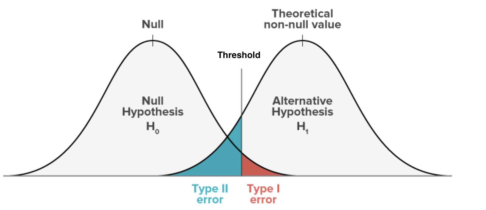
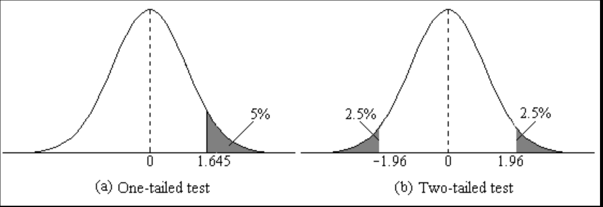

```{r}
#| echo: false
#| results: false
#| warning: false
#| message: false

library(tidyverse)
library(here)
library(patchwork)

options(scipen = 999)

attain <- read_csv(here("data/attain.csv"))

# Pre-process: binary union membership (respondent belongs)
attain <- attain |>
  mutate(
    union_member = if_else(union %in% c("r belong", "r and sp"), 1L, 0L),
    union_label  = if_else(union_member == 1, "Union member", "Non-member")
  )
```

## Agenda {.smaller}

**Housekeeping:**

- Annotated bibliography & Spring Recess

**Statistical content — three parts:**

- **Part 1**: Hypothesis testing — the logic
- **Part 2**: t-tests for means and group differences (+ proportion z-test)
- **Part 3**: Chi-squared test — associations between two categorical variables

**In-class lab:**

- Applying hypothesis tests to your research data

## Housekeeping {.smaller}

**Annotated Bibliography**

- <span class="highlight">Due Thursday, March 19</span>
- Happy to answer last-minute questions after class!
- Example on bCourses under the Research Paper folder

**Weekly Assignment #8**

- <span class="highlight">Due Thursday, April 2</span> (after Spring Recess)
- Involves applying today's hypothesis testing tools to your research dataset

**Spring Recess**

- <span class="highlight">March 24 — enjoy the break!</span>
- Use that time to relax and work on your paper proposal with outline due on 4/16

## Where We Are in the Course {.smaller}

- **Week 7:** sampling distributions and the Central Limit Theorem
- **Week 8:** confidence intervals — estimating population parameters from samples
- **This week (Week 9):** hypothesis testing + chi-squared tests for associations
- **Weeks 10–13:** regression analysis (OLS and logistic)

**Main idea:** Last week we built confidence intervals — a *range* of plausible values for a parameter. Today we flip the question: given a specific claim about the population, how likely are our sample results if that claim were true?

::: {.callout-note icon=false}
## The chain of inference so far:
**Week 7:** Population → Sample → Statistic → Sampling distribution

**Week 8:** Sample → Statistic → Confidence interval → Inference

**Week 9:** Null hypothesis + Sample statistic → Test statistic → p-value → Decision
:::

## Last Week: Recap {.smaller}

| Concept | Key idea | Example |
|--|---|---|
| **Point estimate** | Best single guess for population parameter | $\hat{p} = 0.449$ (GSS env. support) |
| **Standard error** | How uncertain is the estimate? | $SE(\hat{p}) = 0.015$ |
| **Confidence interval** | Range likely to contain the true parameter | 95% CI: [0.420, 0.478] |
| **z vs t** | Proportions → z; Means → t | $z^* = 1.96$; $t^* = 2.447$ ($df = 6$) |

::: {.callout-note icon=false}
## Connection to today:
Last week we *estimated* unknown population parameters and surrounded them with intervals. Today we start from a *specific claim* about the population — and ask whether our data are consistent with it.
:::

## Questions?

# Part 1: Hypothesis Testing

Can we rule out chance as an explanation?

## What Is a Hypothesis Test? {.smaller}

A **hypothesis test** is a formal statistical procedure for evaluating whether a finding is likely due to chance.

::: {.fragment .fade-up}
**The core steps:**

1. **State a null hypothesis** ($H_0$): "there is no real effect" — the finding is just chance
2. **Choose a tail**: does theory predict a direction? → one-tailed; otherwise → two-tailed (default)
3. **Compute a test statistic**: how far is our sample result from what $H_0$ would predict?
4. **Calculate a p-value**: if $H_0$ is true, how likely is a result this extreme?
5. **Decide**: if the p-value is small enough, reject $H_0$; accept $H_1$
:::

::: {.fragment .fade-up}
::: {.callout-note icon=false}
## The core logic:
We don't prove the null hypothesis wrong — we ask: *if it were true, how surprising would our data be?* If very surprising, we have grounds to doubt the null.
:::
:::

## A Motivating Example: James Bond {.smaller}

James Bond claims he can tell whether a martini is **shaken or stirred** just by tasting it.

::: {.fragment .fade-up}
**The experiment:** Give him 16 randomly prepared martinis. He correctly identifies **13 out of 16**.
:::

::: {.fragment .fade-up}
**Null hypothesis ($H_0$):** He's just guessing — each trial is a 50-50 coin flip ($\pi = 0.5$)
:::

::: {.fragment .fade-up}
**Alternative hypothesis ($H_1$):** He can genuinely tell the difference — he performs better than random guessing ($\pi > 0.5$)
:::

::: {.fragment .fade-up}
**The question:** If he were just guessing, how likely is it that he'd get 13 or more right out of 16?

```{r}
#| echo: true
#| eval: true

# P(X >= 13) under H0: X ~ Binomial(n = 16, p = 0.5)
1 - pbinom(12, size = 16, prob = 0.5)
```
:::

::: {.fragment .fade-up}
Probability ≈ **1.1%** — very unlikely if he were just guessing. We have strong evidence he can actually tell the difference.
:::

## P-values {.smaller}

::: {.panel-tabset}

### Definition

A **p-value** is the probability of observing a test statistic **as extreme as (or more extreme than)** the one we got, *assuming the null hypothesis is true*

- **James Bond:** $p = 0.011$ — if guessing randomly, only 1.1% chance of ≥ 13/16 correct

::: {.callout-note icon=false}
## Critical misconception:
**What the p-value is NOT:** the probability that $H_0$ is true. The null hypothesis is either true or false — it doesn't have a probability.

**What the p-value is :** P(data this extreme | $H_0$ true) — the probability of observing results *at least this extreme*, assuming the null holds. It answers: *"if the null were true, how often would we see data like ours?"* — not *"how likely is the null to be true?"*
:::

### What p-values tell us

| p-value | Interpretation |
|---|---|
| Very small (e.g., 0.001) | Data would be very surprising under $H_0$ → strong evidence against $H_0$ |
| Small (e.g., 0.03) | Data somewhat unlikely under $H_0$ → moderate evidence against $H_0$ |
| Large (e.g., 0.40) | Data consistent with $H_0$ → no reason to doubt $H_0$ |

### What p-values do NOT tell us

- ❌ The probability that $H_0$ is true
- ❌ The probability that we made an error
- ❌ How large or important the effect is
- ❌ Whether the finding matters in practice

::: {.callout-tip icon=false}
## Statistical ≠ substantive significance:
A result can be **statistically significant** ($p < 0.05$) but **substantively trivial** — the effect is real but tiny. With large samples, even meaningless effects can reach significance. Always report the *size* of the effect, not just whether it is significant.
:::

:::

## Significance Levels {.smaller}

**How small does the p-value need to be before we reject $H_0$?**

We set a **significance level** $\alpha$ in advance — the threshold below which we'll reject:

::: {.fragment .fade-up}
- **Most common:** $\alpha = 0.05$ — we use this in this class
- Sometimes people use: $\alpha = 0.01$, $\alpha = 0.10$

**Decision rule:**

| Result | Decision |
|-|---|
| $p < \alpha$ | **Reject $H_0$** — accept $H_1$; say the result is "statistically significant" |
| $p \geq \alpha$ | **Fail to reject $H_0$** — we do *not* "accept" $H_0$, we just lack evidence to reject it |
:::

::: {.fragment .fade-up}
::: {.callout-note icon=false}
## Why "fail to reject" — not "accept"?
A negative result doesn't prove the null is true. A small sample may simply be too underpowered to detect a real effect. We might be failing to reject because the effect doesn't exist — or because we didn't have enough data to see it.
:::
:::

## Two Ways to Be Wrong {.smaller}

Every decision has two possible mistakes:

| | $H_0$ is **True** | $H_0$ is **False** |
|---|----|----|
| **Reject $H_0$** | [Type I error]{.highlight} (false positive)  | Correct ✓ |
| **Fail to reject $H_0$** | Correct ✓ | [Type II error]{.highlight} (false negative)|

<br>

::: {.callout-note icon=false}
## In plain language: the paramedic
You arrive at an accident. Is the victim alive ($H_0$) or dead ($H_1$)?

- **Type I error:** You declare them dead when they're alive → they don't get treatment. *Catastrophic.*
- **Type II error:** You rush a dead person to hospital. *Wasteful, but not deadly.*

Here you'd want a very small $\alpha$ — the cost of the errors is not symmetric.
:::

## Trade-off between Type I and II Error  {.smaller}

{width="55%" fig-align="center"}

::: {.callout-note icon=false}
**The trade-off:** Moving the threshold right reduces [Type I error]{.highlight} but increases [Type II error]{.highlight} — and vice versa. You can shrink *both* by increasing $n$, which pulls the two distributions apart.

- Lower $\alpha$ (e.g., 0.05 vs 0.10) → less Type I risk, more Type II risk
- Larger $N$ → distributions pull apart → less Type II risk *without* increasing Type I risk
::: 

## One- and Two-Tailed Tests {.smaller}

::: {.panel-tabset}

### One-Tailed

A **one-tailed test** checks for a significant effect in *one specific direction*

- $H_0: \pi \leq 0.50$ vs. $H_1: \pi > 0.50$
- All of $\alpha$ is in one tail — *critical value is lower* — and therefore easier to reject $H_0$, but only if the effect is in the predicted direction

**James Bond (one-tailed):** Did he perform *better than* random guessing?

```{r}
#| echo: true
#| eval: true

# P(X >= 13): all probability in upper tail
1 - pbinom(12, size = 16, prob = 0.5)
```

### Two-Tailed

A **two-tailed test** checks for a significant effect in *either direction*

- $H_0: \pi = 0.50$ vs. $H_1: \pi \neq 0.50$
- $\alpha$ is split equally — 2.5% in each tail — *critical value is higher* ; **more conservative and more common** in social science

**James Bond (two-tailed):** Did he perform *differently from* random guessing?

```{r}
#| echo: true
#| eval: true

# Multiply by 2: account for both tails
2 * (1 - pbinom(12, size = 16, prob = 0.5))
```

### Visualized

{width="55%" fig-align="center"}

- **One-tailed**: rejection region entirely on one side
- **Two-tailed**: rejection region split — requires a more extreme result to reject

### When to Use Which

| Scenario | Recommended |
|---|---|
| Theory strongly predicts the *direction* | One-tailed (use sparingly!) |
| No strong directional prediction | **Two-tailed** (default) |
| Exploratory research | Two-tailed |

::: {.callout-tip icon=false}
## Default to two-tailed:
Unless you have a strong, pre-specified theoretical reason to predict direction, use a two-tailed test. Effects in the "unexpected" direction are often theoretically important!
:::

:::

## CIs and Hypothesis Tests  {.smaller .scrollable} 

Last week's confidence intervals and today's hypothesis tests are two sides of the same coin:

::: {.fragment .fade-up}
- If the **95% CI does not contain** the null value $\mu_0$ → **reject $H_0$** at $\alpha = 0.05$
- If the **95% CI contains** the null value → **fail to reject $H_0$**
:::

::: {.fragment .fade-up}
```{r}
#| echo: false
#| warning: false
#| fig-height: 2.5
#| fig-align: center

df_ci <- tibble(
  label = c("Reject H₀\n(CI excludes null)", "Fail to Reject H₀\n(CI includes null)"),
  est   = c(0.449, 0.21),
  lo    = c(0.420, 0.18),
  hi    = c(0.478, 0.24),
  col   = c("#4E79A7", "#E15759")
)

ggplot(df_ci, aes(x = est, y = label, color = col)) +
  geom_point(size = 4) +
  geom_errorbarh(aes(xmin = lo, xmax = hi), height = 0.18, linewidth = 1.2) +
  geom_vline(xintercept = 0.20, linetype = "dashed", color = "gray40", linewidth = 1) +
  scale_color_identity() +
  annotate("text", x = 0.20, y = 2.45, label = "H₀: π = 0.20",
           color = "gray40", size = 3.2, hjust = 0.5) +
  labs(x = "Population proportion π", y = NULL,
       title = "Does the 95% CI contain the null value?") +
  theme_minimal(base_size = 10) +
  theme(plot.title = element_text(hjust = 0.5, size = 10)) +
  xlim(0.10, 0.55)
```
:::

::: {.fragment .fade-up}
::: {.callout-note icon=false}
## The equivalence:
The 95% CI is precisely the set of null values you would **fail to reject** at $\alpha = 0.05$. Testing and estimation are equivalent — they just frame the same question differently.
:::
:::

## Questions?

# Part 2: t-Tests for Means and Group Differences

Testing associations involving a continuous outcome variable

## Three Common Tests {.smaller}

| Test | When to use | Key statistic | Example |
|---|---|--|----|
| **One-sample t-test** | Comparing sample to population; $\bar{x} = \mu$ | t-score | Do Berkeley students work more than 20 hrs/week on average? |
| **Two-sample t-test** | Comparing means of two groups; $\bar{x_1} = \bar{x_2}$ | t-score | Do men and women differ in hours worked per week? |
| **Proportion test** | Testing proportions; test if $\hat{p} = P$ | z-score | Is union membership among women different from 20%? |

::: {.callout-note icon=false}
## All three tests follow the same steps:

(1) state $H_0$
(2) choose one- or two-tailed
(3) compute a test statistic measuring how far the sample result is from $H_0$
(4) find the p-value under the null distribution
(5) decide
:::

## Test 1: One-Sample t-Test for a Mean {.smaller .scrollable}

Compare the sample to the population. 

::: {.panel-tabset}

### Setup

**General form of the one-sample t-test:**

$$H_0: \mu = \mu_0 \qquad \text{(sample mean equals a specified population value)}$$

$H_1$ depends on whether the research hypothesis predicts a direction:

| Alternative | Test type | When to use |
|-|--|---|
| $H_1: \mu \neq \mu_0$ | **Two-tailed** | No predicted direction — default choice |
| $H_1: \mu > \mu_0$ | One-tailed (upper) | Theory predicts sample is *higher* than $\mu_0$ |
| $H_1: \mu < \mu_0$ | One-tailed (lower) | Theory predicts sample is *lower* than $\mu_0$ |

---

**Running example:** Is the mean hours worked per week by U.S. adults equal to 40 hours?

- $H_0: \mu = 40$ — the population mean is 40 hours
- $H_1: \mu \neq 40$ — the population mean is something other than 40 (two-tailed)
- Significance level: $\alpha = 0.05$

Under $H_0$, the test statistic follows a **t-distribution** with $df = n - 1$:

$$t = \frac{\bar{x} - \mu_0}{s / \sqrt{n}}$$

### Formula

| Step | What to compute | Formula/Rule |
|-|---|---|
| 1 | State $H_0$ and $H_1$ | $H_0: \mu = \mu_0$; choose $H_1$ based on theory |
| 2 | **One- or two-tailed?** | Does theory predict a direction? → one-tailed; otherwise → two-tailed (default) |
| 3 | Sample mean & SE | $\bar{x}$; $SE = s / \sqrt{n}$ |
| 4 | t-statistic | $t = (\bar{x} - \mu_0) / SE$ |
| 5 | p-value | See below |

::: {.callout-note icon=false}
## Step 2 determines the p-value formula:
- **Two-tailed** ($H_1: \mu \neq \mu_0$): `2 * pt(-abs(t), df = n - 1)`
- **One-tailed upper** ($H_1: \mu > \mu_0$): `1 - pt(t, df = n - 1)`
- **One-tailed lower** ($H_1: \mu < \mu_0$): `pt(t, df = n - 1)`
:::

### R Code

`mu = 40` sets the null hypothesis value — R tests whether the true population mean equals 40.

```{r}
#| echo: true
#| eval: true

hrs_clean <- attain |> filter(!is.na(hrs1))

t1_result <- t.test(hrs_clean$hrs1, mu = 40)
t1_result
```

::: {.callout-note icon=false}
## Reading the `t.test()` output:
- **t = `r round(t1_result$statistic, 2)`**: our sample mean (`r round(t1_result$estimate, 2)` hrs) is `r round(abs(t1_result$statistic), 2)` standard errors above the null value of 40 — that is a large distance
- **df = `r round(t1_result$parameter, 0)`**: degrees of freedom ($n - 1$); we have a large sample
- **p-value < 0.001**: if the true mean were exactly 40 hrs, a result this extreme would occur less than 0.1% of the time — very strong evidence against $H_0$
- **95% CI [`r round(t1_result$conf.int[1], 2)`, `r round(t1_result$conf.int[2], 2)`]**: we are 95% confident the true mean is between `r round(t1_result$conf.int[1], 2)` and `r round(t1_result$conf.int[2], 2)` hrs — this range does not include 40, confirming we reject $H_0$
- **mean of x = `r round(t1_result$estimate, 2)`**: sample mean hours worked per week
:::

### Interpretation

**The sample mean hours worked per week was `r round(t1_result$estimate, 2)` hours.** A one-sample t-test showed this is significantly different from 40 hours ($p$ < 0.001). We **reject $H_0$; we accept $H_1$**: U.S. adults in this sample work significantly more than a standard 40-hour week.

The 95% CI [`r round(t1_result$conf.int[1], 2)`, `r round(t1_result$conf.int[2], 2)`] does not contain 40 — this is the CI equivalent of rejecting $H_0$ at $\alpha = 0.05$.

```{r}
#| echo: false
#| fig-height: 1.6
#| fig-align: center
tibble(
  label = "Mean hours worked",
  est   = as.numeric(t1_result$estimate),
  lo    = t1_result$conf.int[1],
  hi    = t1_result$conf.int[2]
) |>
  ggplot(aes(x = est, y = label)) +
  geom_errorbarh(aes(xmin = lo, xmax = hi), height = 0.12, linewidth = 1.2, color = "#4E79A7") +
  geom_point(size = 4, color = "#4E79A7") +
  geom_vline(xintercept = 40, linetype = "dashed", color = "#E15759", linewidth = 1) +
  annotate("text", x = 40, y = 1.35, label = "H₀: μ = 40", color = "#E15759", size = 3.2) +
  labs(x = "Hours per week", y = NULL, title = "95% CI for mean hours worked — does it contain 40?") +
  theme_minimal(base_size = 10) +
  theme(plot.title = element_text(hjust = 0.5, size = 10),
        axis.text.y = element_text(size = 9))
```

:::


## Test 2: Two-Sample t-Test {.smaller .scrollable}

**Running example:** Do union members work a *different* number of hours per week than non-members?

::: {.panel-tabset}

### Setup

- $H_0$: $\mu_{\text{union}} = \mu_{\text{non-union}}$ (equivalently: $\mu_1 - \mu_2 = 0$)
- $H_1$: $\mu_{\text{union}} \neq \mu_{\text{non-union}}$

Under $H_0$, the test statistic:

$$t = \frac{\bar{x}_1 - \bar{x}_2}{SE_{\text{diff}}} \quad \text{where} \quad SE_{\text{diff}} = \sqrt{\frac{s_1^2}{n_1} + \frac{s_2^2}{n_2}}$$

Degrees of freedom: $df \approx n_1 + n_2 - 2$ (R uses Welch's correction, adjusting df when variances differ)

### R Code

```{r}
#| echo: true
#| eval: true

union_hrs    <- attain |>
  filter(union_member == 1, !is.na(hrs1)) |> pull(hrs1)
nonunion_hrs <- attain |>
  filter(union_member == 0, !is.na(hrs1), !is.na(union)) |> pull(hrs1)

t2_result <- t.test(union_hrs, nonunion_hrs)
t2_result
```

::: {.callout-note icon=false}
## Reading the `t.test()` output:
- **t = `r round(t2_result$statistic, 2)`**: the observed difference in means (`r round(t2_result$estimate[1], 2)` − `r round(t2_result$estimate[2], 2)` = `r round(t2_result$estimate[1] - t2_result$estimate[2], 2)` hrs) is `r round(abs(t2_result$statistic), 2)` standard errors from zero
- **df = `r round(t2_result$parameter, 1)`**: Welch's adjusted degrees of freedom (R accounts for unequal variances)
- **p-value = `r round(t2_result$p.value, 3)`**: a difference this large would occur `r round(t2_result$p.value * 100, 1)`% of the time by chance if $H_0$ were true — does not clear $\alpha = 0.05$
- **95% CI [`r round(t2_result$conf.int[1], 2)`, `r round(t2_result$conf.int[2], 2)`]**: plausible range for the true difference $\mu_{\text{union}} - \mu_{\text{non-union}}$ — this interval **contains 0**, consistent with failing to reject $H_0$
- **means**: union = `r round(t2_result$estimate[1], 2)` hrs, non-union = `r round(t2_result$estimate[2], 2)` hrs
:::

### Interpretation

**Union members worked an average of `r round(t2_result$estimate[1], 2)` hours per week, compared to `r round(t2_result$estimate[2], 2)` hours for non-members** (difference = `r round(t2_result$estimate[1] - t2_result$estimate[2], 2)` hrs). A two-sample t-test showed this difference was not statistically significant ($p$ = `r round(t2_result$p.value, 3)`). We **fail to reject $H_0$**: we cannot conclude union members work different hours than non-members.

The 95% CI on the difference [`r round(t2_result$conf.int[1], 2)`, `r round(t2_result$conf.int[2], 2)`] includes 0 — consistent with failing to reject $H_0$ at $\alpha = 0.05$.

```{r}
#| echo: false
#| fig-height: 1.6
#| fig-align: center
tibble(
  label = "Union − Non-union (hrs/week)",
  est   = t2_result$estimate[1] - t2_result$estimate[2],
  lo    = t2_result$conf.int[1],
  hi    = t2_result$conf.int[2]
) |>
  ggplot(aes(x = est, y = label)) +
  geom_errorbarh(aes(xmin = lo, xmax = hi), height = 0.12, linewidth = 1.2, color = "#4E79A7") +
  geom_point(size = 4, color = "#4E79A7") +
  geom_vline(xintercept = 0, linetype = "dashed", color = "#E15759", linewidth = 1) +
  annotate("text", x = 0, y = 1.35, label = "H₀: diff = 0", color = "#E15759", size = 3.2) +
  labs(x = "Difference in hours per week", y = NULL,
       title = "95% CI for difference in means — does it contain 0?") +
  theme_minimal(base_size = 10) +
  theme(plot.title = element_text(hjust = 0.5, size = 10),
        axis.text.y = element_text(size = 9))
```

:::

## Test 3: Testing a Proportion {.smaller .scrollable}

We follow the same set up, but use a slightly different distribution. 

::: {.panel-tabset}

### Setup

**Running example:** Is the proportion of U.S. adults who are union members equal to 20%?

- $H_0: \pi = 0.20$
- $H_1: \pi \neq 0.20$ (two-tailed)
- Significance level: $\alpha = 0.05$

Under $H_0$, the sampling distribution of $\hat{p}$ is approximately:

$$\hat{p} \sim N\!\left(\pi_0,\; SE_0\right) \quad \text{where} \quad SE_0 = \sqrt{\frac{\pi_0(1-\pi_0)}{n}}$$

::: {.callout-tip icon=false}
## Key distinction — testing vs. estimation:
When *building a CI*, use $SE = \sqrt{\hat{p}(1-\hat{p})/n}$ (the sample estimate).
When *testing a hypothesis*, use $SE_0 = \sqrt{\pi_0(1-\pi_0)/n}$ (the **null value**).
:::

### Formula

**Step 1:** Compute the standard error **under $H_0$**:

$$SE_0 = \sqrt{\frac{\pi_0(1-\pi_0)}{n}} = \sqrt{\frac{0.20 \times 0.80}{n}}$$

**Step 2:** Compute the z-statistic:

$$z = \frac{\hat{p} - \pi_0}{SE_0}$$

**Step 3:** Calculate the p-value:

| Test | R code |
|---|---|
| Two-tailed | `2 * pnorm(-abs(z))` |
| One-tailed (upper) | `pnorm(-abs(z))` |

### R Code

`prop.test()` handles the SE and test statistic automatically — just supply the count of successes, the sample size, and the null value.

```{r}
#| echo: true
#| eval: true

n <- sum(!is.na(attain$union))
x <- sum(attain$union_member, na.rm = TRUE)   # number of union members

# prop.test(successes, n, p = null_value, correct = FALSE)
t3_result <- prop.test(x, n, p = 0.20, correct = FALSE)
t3_result
```

::: {.callout-note icon=false}
## Reading the `prop.test()` output:
- **X-squared = `r round(t3_result$statistic, 2)`**: the test statistic ($z^2$); our sample proportion is `r round(abs(sqrt(t3_result$statistic)), 2)` standard errors from the null value of 0.20
- **p-value = `r round(t3_result$p.value, 4)`**: if the true proportion were exactly 20%, a result this far away would occur `r round(t3_result$p.value * 100, 1)`% of the time — this is our evidence against $H_0$
- **95% CI [`r round(t3_result$conf.int[1], 3)`, `r round(t3_result$conf.int[2], 3)`]**: plausible range for the true union membership rate — check whether this contains 0.20
- **p = `r round(t3_result$estimate, 3)`**: our sample union membership rate ($\hat{p}$)

*Note: `correct = FALSE` turns off the continuity correction — appropriate when $n$ is large.*
:::

### Interpretation

**The sample union membership rate was `r round(t3_result$estimate, 3)` (`r round(t3_result$estimate * 100, 1)`%).** A proportion test showed this was `r ifelse(t3_result$p.value < 0.05, "significantly", "not significantly")` different from 20% ($p$ = `r round(t3_result$p.value, 4)`). We **`r ifelse(t3_result$p.value < 0.05, "reject $H_0$; we accept $H_1$", "fail to reject $H_0$")`**.

The 95% CI [`r round(t3_result$conf.int[1], 3)`, `r round(t3_result$conf.int[2], 3)`] does not contain 0.20 — the null value falls entirely outside the plausible range for the true proportion, confirming we reject $H_0$.

```{r}
#| echo: false
#| fig-height: 1.6
#| fig-align: center
tibble(
  label = "Union membership rate",
  est   = as.numeric(t3_result$estimate),
  lo    = t3_result$conf.int[1],
  hi    = t3_result$conf.int[2]
) |>
  ggplot(aes(x = est, y = label)) +
  geom_errorbarh(aes(xmin = lo, xmax = hi), height = 0.12, linewidth = 1.2, color = "#4E79A7") +
  geom_point(size = 4, color = "#4E79A7") +
  geom_vline(xintercept = 0.20, linetype = "dashed", color = "#E15759", linewidth = 1) +
  annotate("text", x = 0.20, y = 1.35, label = "H₀: π = 0.20", color = "#E15759", size = 3.2) +
  scale_x_continuous(labels = scales::percent_format(accuracy = 1)) +
  labs(x = "Proportion", y = NULL,
       title = "95% CI for union membership rate — does it contain 20%?") +
  theme_minimal(base_size = 10) +
  theme(plot.title = element_text(hjust = 0.5, size = 10),
        axis.text.y = element_text(size = 9))
```

:::

## Worked Example: Household Income {.smaller .scrollable}

::: {.panel-tabset}

### Scenario

Using the GSS `attain` dataset, we test whether respondents' mean household income differs from the **U.S. national median household income of \$30,000** (1991 Census benchmark, the year these data were collected).

The `income91` variable records household income as midpoints of GSS income brackets (e.g., \$500, \$2,000 … \$100,000).

**Research question:** Does mean household income in the GSS sample differ from the national median?

**Question:** Write the hypothesis notation and specify whether this is a one- or two-tailed test.

### Step 1 — Hypotheses

::: {.fragment .fade-up}
**Null hypothesis:** Mean household income in the sample equals the national median:

$$H_0: \mu = \$30{,}000$$
:::

::: {.fragment .fade-up}
**Alternative hypothesis:** Mean household income is *different from* the national median:

$$H_1: \mu \neq \$30{,}000$$
:::

### Step 2 — One or Two-Tailed?

**Two-tailed** — the research question asks whether income differs, not specifically whether it is higher or lower.

::: {.callout-tip icon=false}
## The logic:
We have no directional prediction going in — the GSS sample could plausibly earn more *or* less than the national median. So we split the rejection region ($\alpha = 5\%$) equally across **both tails** (2.5% each). This is the more conservative and more common choice in social science.
:::

### Step 3 — Test Statistic

```{r}
#| echo: true
#| eval: true

inc_clean <- attain |> filter(!is.na(income91))

we_result <- t.test(inc_clean$income91, mu = 30000)
we_result
```

### Step 4 — p-value

```{r}
#| echo: true
#| eval: true

cat("p-value =", format.pval(we_result$p.value), "\n")
```

Since `t.test()` runs a two-tailed test by default, the p-value already reflects both tails.

### Step 5 — Decision and Conclusion

Since $p < 0.001 < \alpha = 0.05$, we **reject $H_0$; we accept $H_1$**.

::: {.callout-note icon=false}
## Conclusion:
The mean household income in our sample (\$`r format(round(we_result$estimate), big.mark=",")`)) is significantly *higher* than the national median of \$30,000 ($p$ < 0.001). The 95% CI [\$`r format(round(we_result$conf.int[1]), big.mark=",")`, \$`r format(round(we_result$conf.int[2]), big.mark=",")`] does not contain \$30,000, confirming we reject $H_0$. GSS respondents earn more than the national median, and this gap is unlikely to be due to sampling error alone.
:::

:::

## Questions?

# Part 3: The Chi-Squared Test

Testing associations between two categorical variables

## The Family of Hypothesis Tests {.smaller}

Every test we've covered this week asks the same fundamental question: **is there a relationship between variables?** The choice of test depends entirely on the *types* of variables involved.

| What we're testing | Outcome variable | Grouping variable | Method |
|---|---|---|---|
| Is a proportion = $P$? | Binary | — | z-test |
| Is a mean = $\mu_0$? | Continuous | — | one-sample t-test |
| Do two group means differ? | Continuous | Binary (2 groups) | **two-sample t-test** |
| Do 3+ group means differ? | Continuous | Categorical (3+ groups) | ANOVA *(not covered)* |
| Are two categorical variables independent? | Categorical | Categorical | **chi-squared test** |

::: {.callout-note icon=false}
## The key decision:
Is your outcome variable **continuous**? → use a t-test (or ANOVA for 3+ groups).
Is your outcome variable **categorical**? → use chi-squared. Note: chi-squared works for *any* number of categories — not just binary variables.
:::

## t-Tests vs. Chi-Squared: Parallel Logic {.smaller}

Both tests ask "Is $X$ related to $Y$?" — for different variable combinations:

::: {.panel-tabset}

### Two-Sample t-Test

**Question:** Does the *mean* of a continuous outcome differ across groups?

- **Outcome:** continuous (e.g., hours worked)
- **Group:** binary/categorical (e.g., union membership)
- **$H_0$:** $\mu_{\text{union}} = \mu_{\text{non-union}}$
- **Test stat:** $t = (\bar{x}_1 - \bar{x}_2) / SE_{\text{diff}}$, compared to t-distribution

*Our example:* Do union members work a different number of hours than non-members? Focusing on the difference in means between the two groups.

### Chi-Squared

**Question:** Does the *distribution* of a categorical outcome differ across groups?

- **Outcome:** categorical (e.g., union membership — yes/no)
- **Group:** categorical (e.g., sex)
- **$H_0$:** Union membership and sex are independent
- **Test stat:** $\chi^2 = \sum (n_{ij} - \hat{n}_{ij})^2 / \hat{n}_{ij}$, compared to $\chi^2$ distribution

*Our example:* Is union membership associated with sex?

### Side-by-Side

| | Two-sample t-test | Chi-squared |
|---|---|---|
| **$H_0$** | $\mu_1 = \mu_2$ | $X$ and $Y$ are independent |
| **Outcome type** | Continuous | Categorical |
| **Group type** | Binary/categorical | Categorical |
| **Test statistic** | $t$ | $\chi^2$ |
| **Distribution** | t ($df = n_1+n_2-2$) | $\chi^2$ ($df = (I{-}1)(J{-}1)$) |
| **Measure of effect** | Difference in means | Difference in proportions |
| **In R** | `t.test(x, y)` | `chisq.test(table)` |

:::

::: {.callout-tip icon=false}
## Choosing your test for hw8:
Does your research question compare a **continuous** outcome across groups? → two-sample t-test.
Does it compare the **rates** of a categorical outcome across groups? → chi-squared.
:::


## Review: Contingency Tables {.smaller .scrollable}

::: {.panel-tabset}

### What Is a Contingency Table?

A **contingency table** shows the joint distribution of two categorical variables — counts of observations in each combination of categories

|  | Non-member | Union member | **Total** |
|---|---|---|---|
| **Female** | $n_{11}$ | $n_{12}$ | $n_{1\bullet}$ |
| **Male** | $n_{21}$ | $n_{22}$ | $n_{2\bullet}$ |
| **Total** | $n_{\bullet 1}$ | $n_{\bullet 2}$ | $n$ |

### In R

```{r}
#| echo: true
#| eval: true

attain_ct <- attain |>
  filter(!is.na(union), !is.na(sex)) |>
  mutate(union_lab = if_else(union_member == 1, "Union", "Non-member"))

# Count table with row and column totals
tab <- table(attain_ct$sex, attain_ct$union_lab)
addmargins(tab)

# Row proportions: union membership rate within each sex
round(prop.table(tab, margin = 1), 3)
```

:::

## The Chi-Squared Logic {.smaller}

::: {.fragment .fade-up}
**The null hypothesis:** The two categorical variables are **independent** — knowing someone's category on one variable tells us nothing about their category on the other

$$H_0: \text{no association between } X \text{ and } Y$$
:::

::: {.fragment .fade-up}
**Under independence**, the expected count in each cell:

$$\hat{n}_{ij} = \frac{(\text{row total}_i) \times (\text{column total}_j)}{n}$$

This is what the table *would look like* if the two variables had no relationship at all.
:::

::: {.fragment .fade-up}
**The test asks:** Are the *observed* cell counts far enough from the *expected* cell counts that we doubt independence?
:::

## The Chi-Squared Test Statistic {.smaller}

$$\chi^2 = \sum_{i}\sum_{j} \frac{(n_{ij} - \hat{n}_{ij})^2}{\hat{n}_{ij}}$$

where $n_{ij}$ = observed and $\hat{n}_{ij}$ = expected count in cell $(i, j)$

::: {.fragment .fade-up}
- **Large $\chi^2$**: observed counts are far from expected → evidence against independence
- **Small $\chi^2$**: observed counts are close to expected → consistent with independence
- **Degrees of freedom**: $(I-1)(J-1)$, where $I$ = number of rows, $J$ = number of columns
:::

::: {.fragment .fade-up}
::: {.callout-note icon=false}
## Assumptions:
1. Data are a random sample from the population
2. Expected count in **each cell ≥ 5** — if not, the chi-squared approximation may not be reliable
:::
:::

## Worked Example 1: Sex and Union Membership {.smaller .scrollable}

::: {.panel-tabset}

### Contingency Table

**Research question:** Is there a significant association between sex and union membership?

```{r}
#| echo: true
#| eval: true

attain_ct |>
  count(sex, union_lab) |>
  pivot_wider(names_from = union_lab, values_from = n) |>
  mutate(Total = `Non-member` + Union)

tab <- table(attain_ct$sex, attain_ct$union_lab)

# Row proportions: union rate within each sex
round(prop.table(tab, margin = 1), 3)
```

### Chi-Squared Test

```{r}
#| echo: true
#| eval: true

chisq_result <- chisq.test(tab, correct = FALSE)
round(chisq_result$expected, 1)  # verify all expected counts ≥ 5
chisq_result
```

*`correct = FALSE` turns off Yates' continuity correction — standard when all expected counts ≥ 5*

### Interpretation

Men were 7.8 percentage points more likely to be union members than women (17.3% vs. 9.5%). A chi-squared test showed this association was statistically significant ($\chi^2$(1) = 26.3, $p$ < 0.001). We **reject $H_0$; we accept $H_1$**: sex and union membership are not independent in this sample.

::: {.callout-note icon=false}
## Important:
Chi-squared only tells you *whether* an association exists — not its direction or magnitude. Always supplement with a difference in proportions.
:::

:::

## Worked Example 2: Sex and Educational Attainment {.smaller .scrollable}

$H_0$: Sex and college attainment are independent. $H_1$: They are not. $\alpha = 0.05$.

::: {.panel-tabset}

### R Code

```{r}
#| echo: true
#| eval: true

attain_deg <- attain |>
  filter(!is.na(sex), !is.na(degree)) |>
  mutate(college = if_else(degree %in% c("bachelor", "graduate"), "College+", "No college"))

attain_deg |>
  count(sex, college) |>
  pivot_wider(names_from = college, values_from = n) |>
  mutate(Total = `College+` + `No college`)

tab2 <- table(attain_deg$sex, attain_deg$college)
round(chisq.test(tab2, correct = FALSE)$expected, 1)  # verify ≥ 5
chisq.test(tab2, correct = FALSE)
```

### Measures

```{r}
#| echo: true
#| eval: true

attain_deg |>
  count(sex, college) |>
  group_by(sex) |>
  mutate(prop = round(n / sum(n), 3)) |>
  select(-n) |>
  pivot_wider(names_from = college, values_from = prop)

college_props <- attain_deg |>
  count(sex, college) |>
  group_by(sex) |>
  mutate(prop = n / sum(n)) |>
  filter(college == "College+")

cat("Difference in proportions:", round(college_props$prop[1] - college_props$prop[2], 3), "\n")
```

### Interpretation

Women were 3.3 percentage points *less* likely than men to have a college degree (22.5% vs. 25.8%). A chi-squared test showed this association was statistically significant ($\chi^2$(1) = 4.3, $p$ = 0.038). We **reject $H_0$; we accept $H_1$**: sex and college attainment are not independent in this sample.

::: {.callout-tip icon=false}
## Writing up chi-squared results — always include:
1. **The group rates** — which group is higher and by how much?
2. **The test result** — $\chi^2$(df), $p$-value
3. **The decision** — reject $H_0$; accept $H_1$ / fail to reject $H_0$
4. **Plain-language conclusion** tied to the research question
:::

:::

## Questions?

## Key Takeaways {.smaller}

::: {.panel-tabset}

### Part 1 — Logic

- A hypothesis test asks: *if the null were true, how likely is our data?*
- The **p-value** is the probability of seeing a result this extreme if the null were true — NOT the probability the null is true
- Reject the null when p < 0.05; otherwise fail to reject (never "accept" the null)
- Default to two-tailed; use one-tailed only when theory predicts a specific direction

::: {.callout-note icon=false}
## Connection to Week 8:
If the 95% CI does **not** contain the null value → reject the null at 0.05. Tests and CIs are two sides of the same coin.
:::

### Part 2 — Tests

| Test | Use when | R function | Example |
|---|---|---|---|
| One-sample t-test | Is the mean = some value? | `t.test(x, mu = value)` | Do GSS respondents earn differently from $30,000? |
| Two-sample t-test | Do two group means differ? | `t.test(x, y)` | Do union members work more hours than non-members? |
| Proportion test | Is a proportion = some value? | `prop.test(x, n, p = value)` | Is union membership different from 20%? |
| Chi-squared | Are two categorical variables independent? | `chisq.test(table)` | Is union membership associated with sex? |

Always report: the group statistic(s), the p-value, your decision, and a plain-language conclusion.

### Part 3 — Chi-Squared

- Tests whether two **categorical** variables are independent
- Compares the counts you *observed* to what you'd *expect* if there were no relationship
- All expected counts must be ≥ 5
- Only tells you *whether* an association exists — not direction or strength
- Always supplement with a **difference in proportions**

:::


## Why This Matters for the Rest of the Course {.smaller}

- **Weeks 10–13 (Regression):** OLS is essentially the two-sample t-test extended to multiple variables simultaneously. Every regression coefficient comes with its own t-test and p-value — built on exactly the same logic we used today.
- **Your research paper:** You will almost certainly use regression. But the interpretation of $p$-values, test statistics, and significance thresholds is *identical* to what we covered today.

::: {.callout-note icon=false}
## Key takeaway:
Hypothesis testing is not just a tool for this week — it is the core inferential logic running through all of statistics. Every result in your paper will be evaluated with the same p-value framework we built today.
:::

## Questions?
